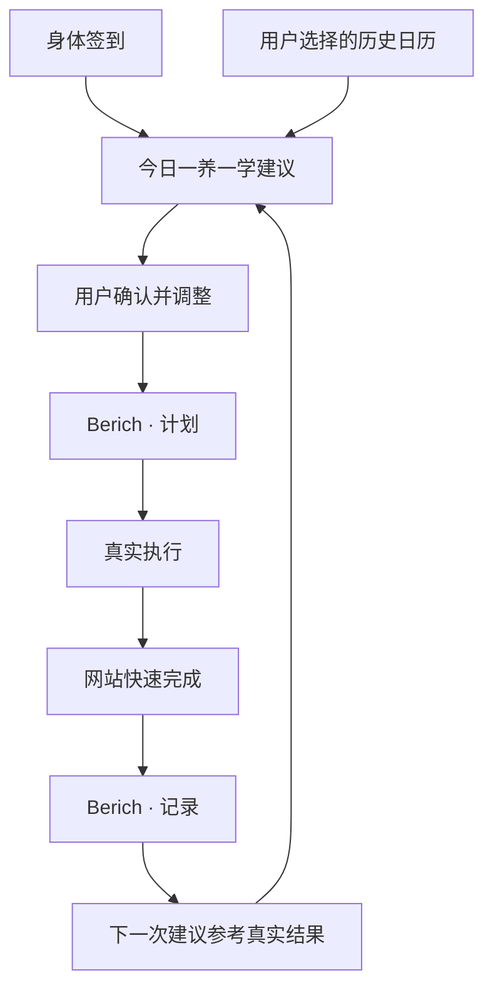

# 身体与知识的每日平衡

## Summary

把现有学习记录产品扩展为身体能量与知识投入的每日平衡工具：首页根据轻量身体签到和日历历史生成“一养一学”建议，“问春风”作为完整独立栏目保留，并以计划、执行、复盘的双日历闭环持续改善建议。“问春风”采用证据驱动的混合生成：先整理可验证事实，再给出明确标注的传统文化解读，最后生成有依据、可执行且说明不确定性的当日建议。

---

## Problem Frame

现有产品能记录学习任务、学习时长与成长数据，但它默认用户每天都有相似的精力，无法回答“我今天的身体适合怎样学习”。身体关照则存在于独立的“Ask My Body 问身”项目中，用户需要在两个产品之间切换，身体状态不会影响学习安排，真实执行结果也不会回到下一次建议里。

当前 Apple 日历已经承载部分学习安排，但计划事件与真实完成情况容易混在一起。只看计划会高估用户实际投入，也无法判断建议是否太满、时间是否合适。与此同时，读取全部日历会带来不必要的私人信息暴露，公网浏览器也不能直接访问每位用户设备中的 Apple 日历。

现有“问春风”报告还能进一步提高可信度：八字解读、天气事实、身体与学习历史以及行动建议需要明确分层，用户应当看得出每条建议用了什么资料、哪些是可验证事实、哪些只是传统文化视角。系统也不能用文学化表达掩盖数据缺失，更不能把“地域气场”包装成可科学测量的结论或确定性吉凶判断。

---

## Actors

- A1. 本地账户用户：记录身体与学习状态、确认建议、安排计划并填写真实执行结果。
- A2. 混合建议生成服务：接收程序已经整理好的事实快照，临时综合生成今日建议或“问春风”解释，不修改确定性事实，也不持久保存用户提交的个人内容。
- A3. Apple 日历：保存用户确认的计划和真实执行记录，并提供用户授权范围内的最小历史字段。
- A4. 公开环境数据源：只接收用户保存的城市，返回带来源和更新时间的天气、空气质量与近期变化；不接收八字、身体或学习数据。

---

## Key Flows

- F1. 每日签到与建议
  - **Trigger:** 用户进入“今日”并开始当天签到。
  - **Actors:** A1, A2, A3
  - **Steps:** 用户点选睡眠、精力、情绪和身体不适，可补充一句话；产品读取用户选择日历中的最小历史字段；系统生成一条养身建议和一条学习建议，并给出建议时间与时长。
  - **Outcome:** 用户看到与当日身体状态和真实历史相符、可以立即确认的“一养一学”计划。
  - **Covered by:** R1, R4, R5, R11, R12

- F2. 确认计划并写入日历
  - **Trigger:** 用户准备采用一条今日建议。
  - **Actors:** A1, A3
  - **Steps:** 用户检查并可调整建议时间与时长；确认后写入 `Berich · 计划`；未确认的建议不写入日历。
  - **Outcome:** Apple 日历中出现明确标记为计划的提醒，不被误认为已经完成。
  - **Covered by:** R6, R7

- F3. 记录真实执行
  - **Trigger:** 用户完成或部分完成一项养身或学习活动。
  - **Actors:** A1, A3
  - **Steps:** 用户在网站点击快速完成，填写实际时长和简短感受；产品按账户保存记录，并写入 `Berich · 记录`；下一次建议比较计划与实际差异。
  - **Outcome:** 历史数据反映真实发生的行为，而不是只反映理想计划。
  - **Covered by:** R8, R9, R10

- F4. 独立使用“问春风”
  - **Trigger:** 用户从主导航进入“问春风”。
  - **Actors:** A1, A2, A4
  - **Steps:** 用户输入八字和城市，或用截图识别八字；首次使用时明确授权可供报告使用的本地资料类别；程序按城市获取公开环境数据并在本地整理八字结构、节气、天气、身体与学习趋势等事实快照；用户可提出自由问题；混合生成服务返回“可验证事实—传统文化解读—今日行动”三层报告，每条建议显示依据与不确定性；输入、授权状态和报告按当前本地账户保存在浏览器。
  - **Outcome:** 用户获得原“问春风”的全部功能，并且能够区分事实、文化解释与行动建议，知道报告使用了哪些资料以及哪些资料缺失。
  - **Covered by:** R2, R3, R13, R16-R25

---

## Requirements

**产品结构与账户**

- R1. 登录后的主导航必须包含“今日”“问春风”“知识”“我的”四个一级栏目；“今日”承担每日平衡入口，“知识”承接现有学习能力。
- R2. “问春风”必须保留八字输入、八字截图识别、出生城市、现居城市、自由提问、节气信息和 AI 报告等全部功能与结果结构；前端不照搬原水墨页面，而是沿用当前 Berich 网站的金色、丝绸和卡片视觉语言及统一导航。
- R3. 身体签到、“问春风”输入与报告、学习数据、建议和完成记录必须按本地账户隔离，并继续只保存在当前设备的当前浏览器中。

**今日平衡**

- R4. 身体签到必须提供睡眠、精力、情绪、身体不适四项点选输入，并允许用户补充一句自由描述。
- R5. 每次今日建议必须保持“一养一学”：一条养身建议和一条学习建议；每条包含建议时间和建议时长，避免生成完整全天日程。
- R6. 建议在写入日历前必须由用户确认，用户可以调整时间和时长；未确认的建议不得自动创建日历事件。

**计划与真实记录**

- R7. 产品必须区分 `Berich · 计划` 与 `Berich · 记录`：前者只保存未来提醒和预计安排，后者只保存真实执行结果。
- R8. 用户必须能够从网站快速完成养身或学习活动，并至少填写实际时长和简短感受。
- R9. 快速完成后，真实结果必须同时进入当前本地账户的历史记录和 `Berich · 记录` 日历。
- R10. 后续建议必须以真实执行记录为主要历史依据，并比较计划与实际之间的差异；计划事件本身不得被视为已完成。

**Apple 日历范围与隐私**

- R11. 用户必须主动选择允许产品读取的 Apple 日历；产品不得默认扫描全部日历。
- R12. 对用户选择的历史日历，产品只可读取日历名称、事件标题、开始时间、结束时间和时长，不得读取地点、参与人、附件或备注。
- R13. 需要 AI 生成时，只可临时发送完成生成所必需的输入；服务端不得持久保存八字、城市、问题、身体签到、日历历史或生成报告。

**兼容与演进**

- R14. 现有学习任务、倒计时、统计和本地账户能力必须保留，但首页应重新组织为每日平衡入口，避免继续堆叠全部学习仪表盘。
- R15. 本地版本必须先完成当前 Mac 的完整双日历读写并经用户确认；未经明确批准，不得部署本轮改动或修改线上域名配置。

**可信的“问春风”**

- R16. “问春风”首次使用个人资料生成报告前，必须列出八字、城市、身体签到、学习历史和真实执行记录等资料类别并取得一次明确授权；授权按当前本地账户保存，后续可默认使用已经授权的类别。用户必须能够随时查看、关闭或重新选择授权；新增资料类别不得沿用旧授权静默加入。
- R17. 环境查询只可向公开数据源发送用户保存的城市，不得请求 GPS 或发送八字、身体、学习和日历内容。天气区必须显示数据来源、观测或更新时间，并在可用时包含温度、湿度、降水、风与空气质量等与行动建议直接有关的字段。
- R18. 在调用生成服务前，程序必须先形成结构化事实快照，至少区分：用户主动提供的信息、确定性计算的八字结构和五行分布、当前节气与近期自然变化、带时间戳的天气事实、身体签到趋势、学习计划与真实执行趋势。未知、缺失和过期数据必须显式标记，不得补写成事实。
- R19. 完整报告必须按顺序分成三层：`可验证事实` 展示输入与来源；`传统文化解读` 从八字、时令和地域关系提供明确标注的文化视角；`今日行动` 给出少量、具体、可调整的养身与学习建议。诗意表达可以保留，但不得取代三层结构。
- R20. 每条行动建议必须显示“依据”和“需观察/不确定性”，并至少引用一项当前报告中的真实证据。证据不足时必须降低表达确定性或不生成该项建议，不得引用缺失资料。
- R21. “地域气场”只可作为传统文化视角，结合城市的大致方位、长期气候特征、当前季节和八字五行讨论“较易适应的方面”与“需要调节的方面”；不得声称气场已被科学测量，不得只给出“相合/不相合”的二元结论，也不得据此预测确定性吉凶。
- R22. “如何看待自然变化”必须同时参考当前节气、当日天气和可获得的近期天气趋势，转化为穿衣与环境调整、饮食饮水、活动强度、学习负荷、休息节奏或观察点等日常行动；建议不得构成疾病诊断或治疗方案。
- R23. 八字结构、节气、天气值和历史统计必须由确定性程序或明确数据源产生，AI 只负责综合解释和回答自由问题。AI 输出与事实快照冲突时，以事实快照为准，冲突内容不得展示为有效建议。
- R24. 天气、空气质量或生成服务暂时不可用时，界面必须说明哪个数据源失败及最后更新时间，并允许用户查看仍可由本地资料产生的部分报告；系统不得虚构实时环境状况。
- R25. 报告不得给出医疗诊断、确定性灾祸判断，或仅凭八字和“地域气场”要求用户作出迁居、投资、停药等重大决定。身体签到出现明显危险描述时，只能提示用户及时寻求合格专业帮助。
- R26. “问春风”资料必须把出生城市与现居城市作为两个独立字段按当前本地账户保存。出生城市用于描述成长地域的传统文化背景，现居城市用于查询当前天气、空气质量和节气环境，两者共同用于讨论地域变化下较易适应与需要调节的方面；系统不得把两者混为同一地点。
- R27. 八字文字输入和素材导入必须合并为一个统一的混合输入框，不再上下堆叠两个大边框。用户在框内键入时进入文字模式；把 TXT、JPG、PNG 或 WebP 拖入同一框，或点击框内的文件操作时进入导入/识别模式；识别结果回填后仍可直接编辑。切换模式不得丢失已保存资料，也不得移除原有拖放、文件选择、图片识别和本机隐私提示能力。

---

## Acceptance Examples

- AE1. **Covers R3, R9.** 给定同一浏览器中有两个本地账户，当 Jane 完成一项 25 分钟学习活动后，该记录只出现在 Jane 的网站历史中，不出现在另一账户中。
- AE2. **Covers R5, R6.** 给定用户完成身体签到，当系统生成一条 10 分钟养身建议和一条 40 分钟学习建议时，用户可以先调整时间；只有点击确认的建议才写入 `Berich · 计划`。
- AE3. **Covers R7, R8, R9, R10.** 给定一项计划学习 40 分钟的事件，用户实际学习 25 分钟并填写“注意力一般”，`Berich · 记录` 保存 25 分钟和该感受；下一次建议可使用 15 分钟偏差，不能把 40 分钟当成真实学习时长。
- AE4. **Covers R11, R12.** 给定用户只授权“学习”和“健身”日历，建议可以使用其中事件的标题和时长，但不能读取未选择的“家庭”日历，也不能读取已选择事件中的地点、参与人、附件或备注。
- AE5. **Covers R2, R3, R13.** 给定用户在“问春风”中输入八字、城市和问题，系统临时生成报告后，输入和结果保存在当前本地账户；服务端没有可供后续查询的个人内容副本。
- AE6. **Covers R15.** 给定本地版本尚未通过用户验收，本轮功能不得部署至 `berichmyfriend.com` 或其线上预览环境。
- AE7. **Covers R13, R16.** 给定用户首次允许“问春风”使用八字、城市、身体签到和学习历史，后续报告可默认使用这些类别；当用户关闭身体签到授权后，新报告不再包含该类别，另一账户也不能继承这份授权。
- AE8. **Covers R17-R20, R22.** 给定用户城市为北京且公开数据源返回带时间戳的降温、大风和空气质量数据，报告先展示这些事实及来源，再单独展示传统文化解读；“减少室外高强度活动”必须引用大风或空气质量证据，并说明用户仍需按实际体感调整。
- AE9. **Covers R18, R23, R24.** 给定天气查询失败，报告明确显示实时天气不可用及最后成功更新时间，仍可展示本地八字、节气和历史趋势；报告不得声称“今天正在下雨”。
- AE10. **Covers R21, R25.** 给定八字文化解读认为用户在当前地域有“需要调节”的一面，报告可以提出日常观察建议，但不得宣称城市与用户绝对不合，也不得建议用户仅凭该结论迁居或作出重大决定。
- AE11. **Covers R18, R20, R23.** 给定结构化事实快照显示过去七天只有两次真实学习记录，AI 不得写成“你连续学习了七天”；建议必须引用真实的两次记录或明确说明历史样本不足。
- AE12. **Covers R17, R21, R26.** 给定用户出生城市为成都、现居城市为北京，环境服务只用北京查询当前天气与空气质量；报告可以分别展示成都与北京的地域文化背景并讨论变化，但不得把成都天气当成用户当前环境，也不得请求 GPS。
- AE13. **Covers R2, R27.** 给定用户聚焦统一八字输入框并开始键入，页面保持文字模式且不触发文件上传；当用户把受支持图片拖入同一个框时，页面切换到识别状态，识别结果回填为可编辑文字，页面不再出现截图中彼此分离的文字框和大面积素材框。

---

## Success Criteria

- 用户能在十几秒内完成身体签到，并在同一首页获得清晰、可执行的一条养身建议和一条学习建议。
- 用户能明确区分“准备做什么”和“实际做了什么”，日历历史不会再把计划时长误作真实投入。
- 下一次建议能够引用真实执行和计划偏差，而不是只根据固定模板或单次签到生成。
- “问春风”原有全部功能完整可用，视觉与当前 Berich 网站一致，并且遵守本地账户隔离、备份和恢复规则。
- 用户能在一屏内区分事实、传统文化解读和行动建议，并能从每条建议回看它使用的资料、来源时间及不确定性。
- 相同事实快照中的八字结构、节气、天气值和历史统计保持一致；AI 不得改写这些事实，外部数据不可用时也不会虚构实时结论。
- 用户只需填写一次出生城市和现居城市，后续报告能明确区分成长地域与当前环境；八字键入、拖放和文件选择在同一个视觉输入框中完成。
- 用户可以明确控制允许读取的日历和字段范围，不需要暴露无关的私人日程内容。
- 后续规划可以直接围绕上述流程和验收示例拆分工作，不需要重新发明首页定位、隐私边界或日历语义。

---

## Scope Boundaries

### Deferred for later

- 公网版本通过 iPhone/Mac 快捷指令连接每位用户自己的 Apple 日历。
- 将更多穿戴设备或 Apple Health 数据加入身体建议。
- 在用户明确需要后，再评估更丰富的身体趋势和长期复盘视图。
- 将现有学习或健身日历中的历史事件选择性导入 `Berich · 记录`。

### Outside this product's identity

- 不迁入“问身”的完整睡眠报告、夜间 Agent 和重型身体仪表盘；本产品保持轻量每日关照。
- 不做疾病诊断、治疗方案或医疗效果承诺。
- 不自动读取全部 Apple 日历，也不读取地点、参与人、附件或私人备注。
- 不要求用户提交 iCloud 账号专用密码来连接日历。
- 不自动生成和写入完整全天日程。
- 不把服务端用户数据库作为本轮账户或个人记录的存储方式。
- 不请求精确 GPS，不将八字、身体或学习资料发送给天气服务。
- 不把“地域气场”宣传为科学测量结果，不生成确定性吉凶、医疗诊断或重大人生决策指令。

---

## Key Decisions

- 今日平衡优先：首页先理解身体状态，再安排知识投入，让身体与学习形成一条日常主线。
- 一养一学：控制建议数量，优先提高真实完成率，而不是展示更多内容。
- “问春风”独立保留：全部功能、结果结构和独立输入流程保留，但视觉统一到当前 Berich 网站，不拆成首页零散组件。
- 双日历语义：计划与真实记录分离，避免历史数据失真，并允许评估计划是否合理。
- 用户确认后写入：日历安排保持可控，建议不会未经同意占用用户时间。
- 选择性最小读取：建议质量只使用必要事件参数，避免私人日程信息扩大暴露面。
- 本地先行：先在当前 Mac 验证完整闭环，再为公网用户设计设备侧快捷指令。
- 证据驱动的混合生成：程序负责确定性计算和事实采集，AI 只做综合解释，避免自然语言模型改写基础事实。
- 一次授权、持续可控：个人资料类别首次明确授权后可默认使用，但授权按本地账户隔离、可查看、可撤回，新增类别必须重新询问。
- 三层可信表达：可验证事实、传统文化解读和今日行动严格分层，每条行动都展示依据与不确定性。
- 城市级环境信息：只用用户保存的城市查询公开天气与空气质量，不请求精确位置，并显示来源和更新时间。
- 地域解读不作定论：从传统文化角度讨论适应与调节，不将“气场”伪装成科学事实或二元吉凶判断。
- 两地语义分离：出生城市描述成长地域背景，现居城市决定实时环境查询，两者共同参与地域变化的传统文化对照。
- 一个八字输入面：文字输入与素材导入共享同一个视觉容器，以用户当前动作切换模式，识别结果仍回到可编辑文字。

---

## Dependencies / Assumptions

- 当前用户愿意授予本地应用访问所选 Apple 日历的权限。
- 用户会用网站的“快速完成”记录真实执行；仅存在于计划日历而没有完成记录的活动不算真实执行。
- 建议生成服务能够遵守不持久保存个人输入的产品约束。
- 现有本地账户、学习任务和数据备份能力继续作为新体验的基础。
- 养身建议是一般生活关照，不能替代专业医疗意见。
- 公开天气与空气质量数据源能够按城市返回来源、更新时间和建议所需的基础字段；数据不可用时允许明确降级。
- 现有八字排盘与节气算法可以输出结构化、可复核并带版本标识的事实，不把 AI 生成文字当作基础计算结果。

---

## Outstanding Questions

### Deferred to Planning

- [Affects R7, R11, R12][Technical] 现有本地日历能力如何支持双日历、用户选择授权范围和最小字段读取，同时保持当前学习日历功能兼容？
- [Affects R2, R13][Technical] “问春风”现有生成链路如何迁入当前本地账户模型，并验证服务端不持久保存输入与报告？
- [Affects R3, R14][Technical] 现有本地学习数据、账户备份与新身体/建议记录之间如何统一导入导出行为？
- [Affects R15][Needs research] 本地验收应覆盖哪些 macOS 日历授权状态和失败降级场景？
- [Affects R17, R24][Needs research] 选择哪个公开天气与空气质量数据源，如何定义数据新鲜度、超时和缓存降级？
- [Affects R18, R23][Technical] 如何把现有八字排盘、节气计算和历史统计整理成稳定、带版本的事实快照，并阻止 AI 改写确定性字段？
- [Affects R16][Technical] 一次授权如何按本地账户保存、展示和撤回，同时确保新增资料类别必须重新授权？
- [Affects R19-R23][Technical] 生成结果如何携带证据引用，前端怎样验证引用存在且与事实快照一致，再决定是否展示建议？
- [Affects R17, R21, R26][Technical] 出生城市和现居城市如何分别规范化同名地点、保存用户一次选择，并保证只有现居城市进入实时天气查询？
- [Affects R27][Technical] 统一输入框的文字、拖放、识别中、识别失败和回填编辑状态如何建模，才能保留现有文件能力且避免模式切换丢失内容？
