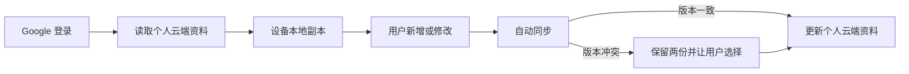

# Google 登录与云端同步

## Summary

把 Berich 从单浏览器本地账户升级为 Google 云端账户：每位用户可以跨浏览器读取自己的资料，同时保留本地优先、离线使用、备份导出和显式冲突保护。

---

## Problem Frame

当前账户、密码摘要和全部个人资料都保存在创建账户的浏览器中。同一个邮箱在另一个浏览器中并不存在，因此密码正确也无法跨浏览器登录；清除站点数据还可能失去全部记录。用户已经实际遇到新密码在另一个浏览器无法登录的问题，并需要现有学习、身体签到、问春风和知识数据跟随账户。

---

## Actors

- A1. 现有资料所有者：把当前浏览器中的本地资料迁移到自己的 Google 账户，并在不同设备继续使用。
- A2. 普通 Google 用户：通过 Google 注册或登录，只访问自己的资料。
- A3. 云端身份与同步服务：验证身份、隔离用户数据、保存版本并协调同步冲突。
- A4. 当前设备：保存用户自己的离线副本，以及只属于该设备的 Calendar、AI Key 和本机文件连接信息。

---

## Key Flows

- F1. Google 注册与登录
  - **Trigger:** 用户在登录页选择 Google 登录。
  - **Actors:** A2, A3
  - **Steps:** 用户完成 Google 授权；系统建立或读取对应的个人账户；加载该账户的云端资料；当前设备建立只属于该账户的本地副本。
  - **Outcome:** 用户进入自己的 Berich 空间，不能读取其他用户的资料。
  - **Covered by:** R1-R4, R14

- F2. 首次迁移现有资料
  - **Trigger:** A1 首次使用 `mountionzeng@gmail.com` 登录，并且当前浏览器存在旧本地资料。
  - **Actors:** A1, A3, A4
  - **Steps:** 系统展示待迁移资料类别、记录数量和更新时间摘要；用户明确确认；系统上传到该 Google 账户；上传完成后重新读取并核对摘要。
  - **Outcome:** 现有资料安全归入正确的 Google 账户，未确认前不上传、不覆盖。
  - **Covered by:** R5-R8

- F3. 自动与离线同步
  - **Trigger:** 已登录用户读取、新增、修改或删除资料。
  - **Actors:** A2, A3, A4
  - **Steps:** 系统先更新当前设备副本；在线时自动同步，离线时记录待同步变更；恢复网络后继续同步；同步成功后展示最近同步状态。
  - **Outcome:** 日常使用不需要手动点击同步，断网也不会阻止记录。
  - **Covered by:** R9-R11

- F4. 冲突处理
  - **Trigger:** 当前设备准备上传时发现云端版本已经被另一台设备修改。
  - **Actors:** A1 或 A2, A3, A4
  - **Steps:** 系统停止自动覆盖；保留本地和云端两个版本；展示时间、设备和内容摘要；用户选择保留其中一份或导出后再决定。
  - **Outcome:** 同时编辑不会静默丢失资料。
  - **Covered by:** R12-R13

---

## Requirements

**身份与隔离**

- R1. 登录页必须提供 Google 登录，所有拥有可用 Google 账户的用户都可注册或登录。
- R2. 每个 Google 身份只能访问自己的学习、身体签到、问春风、知识和账户资料；任何客户端输入都不能绕过账户隔离。
- R3. Google 登录状态应在正常浏览器会话之间保持，除非用户主动退出、撤销授权或会话因安全原因失效。
- R4. 用户退出后，界面不得继续展示该账户资料；再次访问需要重新验证对应身份。

**首次迁移与兼容**

- R5. 检测到旧本地账户资料时，系统必须先展示迁移摘要，至少包括资料类别、记录数量和最近更新时间。
- R6. 只有用户明确确认后，旧本地资料才能上传到当前 Google 账户；取消迁移不得删除或修改原资料。
- R7. 迁移前必须确认当前 Google 邮箱，防止把个人资料上传到错误账户。
- R8. 原有本地密码账户、JSON 备份和导入能力在迁移验证完成前继续可用；迁移不得改变学习总时长、任务状态或已保存报告。

**同步与离线**

- R9. 学习记录、身体签到、问春风资料与报告、知识资料和复习记录必须随当前 Google 账户同步。
- R10. 登录加载、用户保存和网络恢复后应自动同步，并向用户显示最近成功同步时间、离线或失败状态。
- R11. 断网时用户仍可读取本机已有资料并新增或修改；待同步内容必须保留到成功上传或用户明确放弃。

**冲突与数据保护**

- R12. 上传前发现云端版本已变化时，系统不得使用最后写入者自动覆盖，必须保留本地版和云端版。
- R13. 冲突界面必须提供足以识别两个版本的摘要，并允许用户选择、导出或稍后处理；未选择前两份数据都不能丢失。
- R14. 云端保存、读取、更新和删除操作必须以经过验证的 Google 用户身份为边界；公开页面不得暴露任何用户资料。

**隐私与账户控制**

- R15. Apple Calendar 权限和事件标识、AI API Key、Obsidian Vault 路径及其他本机连接信息不得上传云端。
- R16. 首次上传个人资料前必须告知同步的数据类别；现有资料授权规则不能因为启用云同步而自动扩大外部 AI 的使用范围。
- R17. 用户必须能够导出自己的全部云端资料、删除自己的云端资料并退出登录；删除前需要明确确认。
- R18. 隐私说明必须准确区分云端同步资料和设备本地资料，不再把全部数据描述为“仅存本机”。

---

## Acceptance Examples

- AE1. **Covers R1-R4.** 给定用户在浏览器 A 使用 Google 登录并保存资料，当他在浏览器 B 使用同一 Google 账户登录时，可以看到同一份资料；另一个 Google 用户登录后看不到这些内容。
- AE2. **Covers R5-R8.** 给定当前浏览器存在 3461 分钟学习记录和旧问春风资料，当用户首次用 `mountionzeng@gmail.com` 登录时，系统先展示摘要；只有确认后才上传，迁移后学习总时长仍为 3461 分钟。
- AE3. **Covers R7.** 给定用户误用另一个 Google 邮箱登录，当迁移摘要显示该邮箱时，用户可以取消；旧资料仍留在原浏览器且未上传。
- AE4. **Covers R9-R11.** 给定用户断网后新增学习记录，页面显示待同步；恢复网络后记录自动上传，在另一浏览器重新加载后可见。
- AE5. **Covers R12-R13.** 给定两台设备从同一版本分别修改问春风资料，第二台上传时检测到冲突；系统保留两份并等待选择，不能静默覆盖第一台内容。
- AE6. **Covers R15-R16.** 给定用户同步全部个人资料，另一台浏览器可以看到学习和问春风内容，但不会获得原设备的 Calendar 权限、DeepSeek Key 或 Obsidian 路径，也不会继承未重新确认的设备授权。
- AE7. **Covers R17-R18.** 给定用户请求删除云端资料，系统明确说明影响并取得确认；完成后其他设备无法再读取云端副本，本机仍存在的离线副本被准确提示并可单独清除。

---

## Success Criteria

- 用户可以在两个不同浏览器使用同一 Google 账户登录，并看到一致的个人资料。
- 当前浏览器中的主要历史数据经确认迁移后，记录数量、状态和学习总时长保持一致。
- 正常日常使用不需要手动同步；离线记录恢复联网后能够可靠上传。
- 两台设备同时编辑时不会静默丢失任何一个版本。
- 普通用户无法读取、修改或删除其他 Google 用户的数据。
- 产品界面与隐私说明能够清楚区分云端资料、离线副本和设备专属连接信息。
- 后续实施规划不需要重新决定迁移确认、同步时机、冲突策略或数据边界。

---

## Scope Boundaries

- 不提供多人共同编辑同一份资料或实时协作。
- 不允许管理员直接浏览用户的私人学习、身体或问春风内容。
- 不在云端保存 Apple Calendar 权限、AI API Key、Obsidian 路径或本机文件内容。
- 不让公网服务直接访问用户电脑上的 Obsidian Vault。
- 不在第一版移除原本的本地密码账户和 JSON 备份功能。
- 不做社交动态、好友关系或公开分享个人资料。

---

## Key Decisions

- Supabase 承担 Google 身份和云端资料能力，以一个服务覆盖认证、用户隔离与持久化。
- 所有 Google 用户都可以注册，但每个用户只能访问自己的数据。
- 首次迁移采用“先摘要、后确认”，避免误传和错误账户覆盖。
- 同步保持本地优先：本机副本支持离线，联网后自动同步。
- 冲突采用“保留两份、用户选择”，不采用最后写入者自动覆盖。
- 设备权限与密钥不跟随账户同步，降低敏感连接信息的暴露范围。

---

## Dependencies / Assumptions

- 用户能够访问并完成 Google OAuth 登录。
- 需要一个由项目所有者控制的 Supabase 项目，并正确配置 Google 登录和正式域名回调地址。
- 正式部署环境能够安全保存公开连接配置和服务端密钥；服务端密钥不得进入浏览器包或源码。
- 当前本地数据已有稳定的导出和导入边界，可作为首次迁移与完整性核对基础。
- 启用云同步前需要更新隐私政策，说明云端保存的数据类别、用途、保留和删除方式。

---

## Outstanding Questions

### Deferred to Planning

- [Affects R9-R13][Technical] 当前整体状态与分模块记录应采用怎样的版本边界，才能在不丢数据的前提下保持自动同步简单可靠？
- [Affects R5-R8][Technical] 如何把现有本地账户可靠绑定到 Google 身份，并在迁移完成后验证摘要一致？
- [Affects R14, R17][Technical] 如何通过自动化测试验证用户级访问控制、删除和匿名访问拒绝？
- [Affects R3, R4][Needs research] Google 会话的有效期、刷新与撤销行为如何在 Supabase 和当前前端中呈现？
