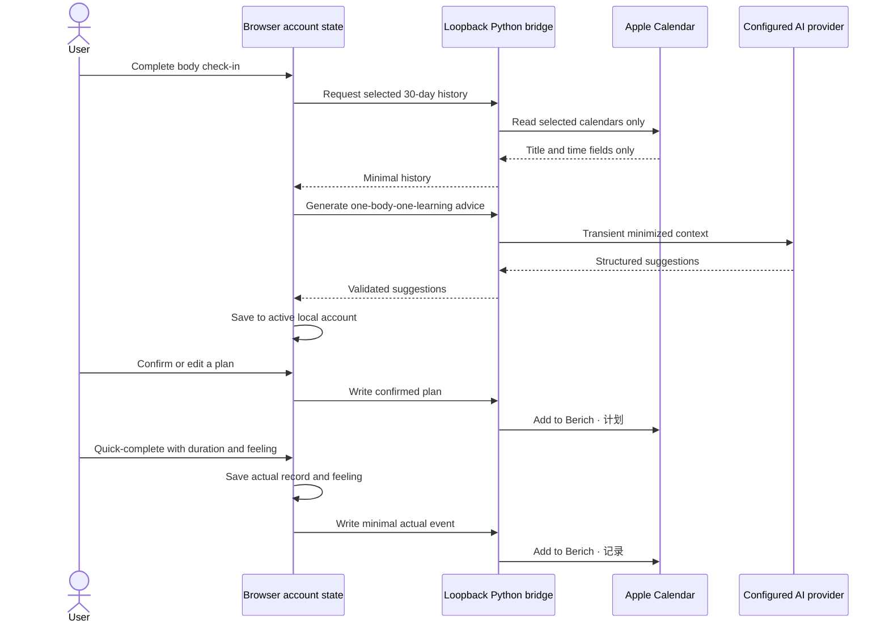
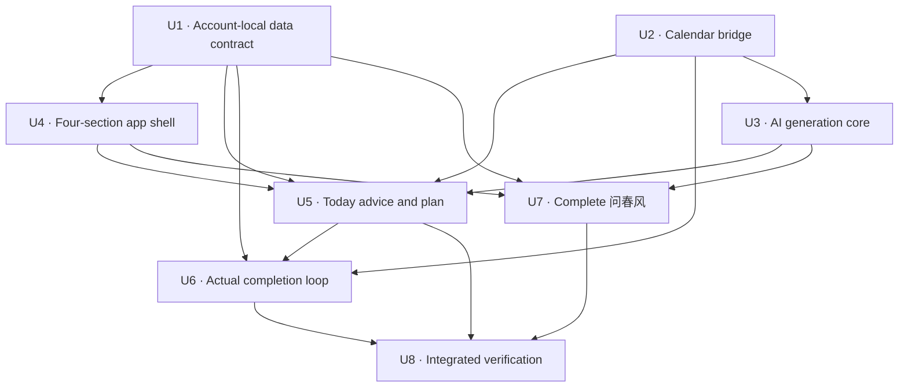
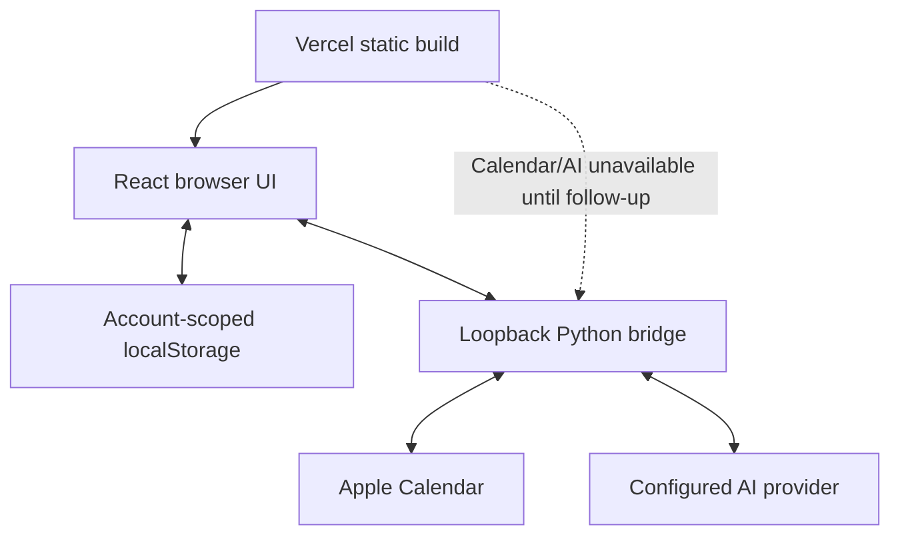

# feat: Integrate daily body-knowledge balance and Apple Calendar loop

## Summary

Extend the existing React + Python local-first application rather than replacing its stack: evolve the browser-account data contract, add a loopback-only Calendar/AI bridge, reorganize the UI into four sections, then land the daily “one body, one learning” loop and the complete “问春风” feature using the current Berich visual language.

---

## Problem Frame

The current browser app keeps each account’s learning data local, but its React entry point is a single learning dashboard and its local API intentionally skips system Calendar writes. The Python service has a separate, fixed-calendar AppleScript path that operates on `study_state.json`, while “问春风” lives in a separate Next.js project. A safe implementation must connect these surfaces without moving personal browser data into server storage or breaking the existing learning experience (see origin: `docs/brainstorms/2026-08-05-body-knowledge-daily-balance-requirements.md`).

---

## Requirements

- R1. Provide four primary sections: 今日, 问春风, 知识, 我的; keep the existing learning workflow under 知识.
- R2. Preserve all “问春风” capabilities and report structure, while rendering them in the existing Berich gold, silk, and card visual language.
- R3. Keep body check-ins, “问春风” inputs/reports, suggestions, learning data, and completion records isolated by browser-local account.
- R4. Capture sleep, energy, mood, body discomfort, and an optional note in the lightweight body check-in.
- R5. Generate exactly one body-care suggestion and one learning suggestion, each with a proposed time and duration.
- R6. Require user confirmation and allow time/duration adjustment before any plan is written to Calendar.
- R7. Keep `Berich · 计划` and `Berich · 记录` semantically separate.
- R8. Collect actual duration and a short feeling through the website’s quick-complete flow.
- R9. Save an actual completion to the current browser account and to `Berich · 记录`.
- R10. Base later suggestions primarily on actual records and plan-versus-actual differences, never treating plan events as completed work.
- R11. Read only calendars the user explicitly selects.
- R12. Return only calendar name, title, start, end, and duration from selected historical calendars.
- R13. Send only generation-required content to the configured AI provider; never persist personal request or response bodies on the application server.
- R14. Preserve current task, countdown, statistics, account, backup, and restore behavior while moving the dense dashboard out of the default home view.
- R15. Complete and verify the Mac-local version before any deployment or DNS change.

**Origin actors:** A1 (本地账户用户), A2 (建议生成服务), A3 (Apple 日历)

**Origin flows:** F1 (每日签到与建议), F2 (确认计划并写入日历), F3 (记录真实执行), F4 (独立使用“问春风”)

**Origin acceptance examples:** AE1 (account isolation), AE2 (confirmation before plan write), AE3 (planned versus actual duration), AE4 (selected-calendar minimum fields), AE5 (“问春风” local persistence), AE6 (no deployment before local acceptance)

---

## Scope Boundaries

### Deferred for later

- Public-web Calendar access through a per-user iPhone/Mac Shortcut.
- Additional wearable-device or Apple Health inputs.
- Richer long-term body trend dashboards after the lightweight daily loop proves useful.
- Selective import of existing learning or fitness events into `Berich · 记录`.

### Outside this product's identity

- The full Ask My Body sleep-report pipeline, night agents, or a heavy health analytics dashboard.
- Disease diagnosis, treatment advice, or medical-outcome claims.
- Automatic access to every Apple Calendar or access to location, attendees, attachments, and notes.
- iCloud app-password or CalDAV credential collection.
- Automatic full-day scheduling.
- A server-side user database for this version’s account or personal records.

### Deferred to Follow-Up Work

- iOS, Mini Program, CLI, and desktop-overlay parity for the new body and “问春风” features; those surfaces remain unchanged until the local web flow is accepted.
- Production deployment, Vercel AI routes, domain changes, and the public Shortcut companion; these require a separate user-approved rollout plan.

---

## Context & Research

### Relevant Code and Patterns

- `web/src/localData.js` already provides browser-account namespacing, normalization, local CRUD, and JSON export/import. New personal state should extend this contract rather than create unrelated global localStorage keys.
- `web/src/localData.test.js` uses Node’s built-in test runner and an in-memory Storage implementation; it is the pattern for account-isolation and migration coverage.
- `web/src/App.jsx` contains the account gate and all learning UI in one file. The work should extract feature pages while keeping the current learning components behaviorally intact.
- `web/scripts/build.mjs` and `web/package.json` provide a small React 18 + esbuild static build that also deploys to Vercel; the plan preserves this pipeline.
- `wealth_center_web.py` is a thin same-origin local HTTP server but still owns route parsing. New local-only bridge routes should remain adapters over isolated core modules.
- `core/calendar_sync.py` already isolates AppleScript execution and escaping, but currently writes only to a fixed “学习” calendar and does not read history.
- `ios/WealthFlowCenter/WealthFlowCenter/CalendarService.swift` demonstrates the repository’s EventKit permission handling, but the current delivery surface is the local website, so EventKit remains a future native-app pattern rather than the v1 implementation path.
- In the user-provided Ask My Body reference project, `app/chunfeng/page.tsx`, `app/api/spring-wind/route.ts`, `app/api/parse-bazi/route.ts`, `lib/bazi.ts`, `lib/agents/spring-wind.ts`, and `prompts/spring-wind.md` define the complete “问春风” behavior to preserve. Their Next.js/Tailwind presentation is a behavior reference, not a stack or visual template.

### Institutional Learnings

- `docs/solutions/architecture-patterns/multi-platform-core-extraction-and-frontend-splitting-2026-05-08.md` establishes the repository pattern: keep business logic in testable core modules, keep HTTP handlers thin, isolate external integrations, and avoid expanding a monolithic frontend entry point.
- That learning also favors atomic, backward-compatible data evolution and test seams around I/O; the Calendar and AI adapters should accept fake transports/runners in tests rather than invoking real external systems.

### External References

- Apple, [Accessing Calendar using EventKit and EventKitUI](https://developer.apple.com/documentation/eventkit/accessing-calendar-using-eventkit-and-eventkitui): reading historical events requires full access, whereas write-only access is insufficient; future native/Shortcut work must request only the level it actually needs.
- Apple, [EKEventStore](https://developer.apple.com/documentation/eventkit/ekeventstore): calendar queries should be bounded by selected calendars and a time predicate, and authorization failure must be an explicit state.

---

## Key Technical Decisions

- **Extend React + Python; do not migrate to Next.js:** this preserves the working local-account and static-deployment model while porting only “问春风” behavior.
- **Keep personal truth in browser storage:** the Python bridge receives transient requests and returns results but does not write check-ins, reports, selected calendars, or activity records to `study_state.json` or another server file.
- **Treat loopback as a network boundary, not authentication:** bind the local service to `127.0.0.1`, issue a random process-lifetime capability token only through the loopback-served document, require it in a custom header on every Calendar/AI route (including existing write routes), strictly validate Host, Origin, and `Sec-Fetch-Site`, apply request-size/time/concurrency limits, and expose no permissive CORS policy. The token is never bundled, logged, or persisted.
- **Use a 30-day Calendar history window:** it matches the current learning dashboard horizon, limits personal-data exposure, and provides enough recent context for daily suggestions.
- **Create plan/record calendars lazily:** `Berich · 计划` or `Berich · 记录` is created only after a user-confirmed write, never merely by opening a page or listing calendars.
- **Reconcile Calendar writes rather than blindly retry:** each projection carries a stable operation ID that is also written as a machine-readable marker on the event in the Berich-owned target calendar. Before retry, and after a timeout/connection loss, the bridge searches only that calendar and bounded time range for exactly one matching marker. A lost acknowledgement becomes `ambiguous` until reconciliation; if the local macOS Calendar interface cannot reliably round-trip the marker, v1 explicitly provides at-least-once delivery plus manual reconciliation instead of claiming idempotency.
- **Separate portable account truth from device-local projections:** backup/import preserves check-ins, suggestions, plans, actual records, “问春风” data, and stable domain IDs, but clears selected-calendar grants, Calendar event IDs, attempt tokens, and sync-success claims. Imported records start as `imported/not_synced` and require calendar re-selection; a backup never asserts that another browser or Mac already contains the projected events.
- **Use an explicit plan/actual accounting contract:** new records keep `planned_start/end/duration` independent from `actual_start/end/duration`; pending work has no actual values. New learning rewards are finalized from actual duration at completion, while legacy completed rewards remain frozen so migration does not change accumulated wealth.
- **Keep feelings browser-only:** Calendar record events contain activity title/category and actual time range; the free-text feeling remains in the local account and is sent to AI only when needed for a later suggestion.
- **Derive quick-complete time from completion time:** actual end defaults to the click time and actual start is computed from the user-entered duration; the flow does not add another required field.
- **Proxy AI locally with secrets outside the bundle:** provider credentials are read from ignored local environment configuration, never copied from the reference project, committed, or returned to the browser.
- **Require scoped AI consent and minimized payloads:** before the first text-generation or image-recognition transmission, show the configured provider, exact field categories sent, image use, known retention/training terms (or that they are unverified), and how to continue without sending. Consent is scoped separately for text and images, and the bridge builds purpose-specific payloads rather than serializing account state.
- **Separate AI output contracts:** daily advice uses validated structured output for two editable suggestions; “问春风” preserves its Markdown report but renders only fixed text/heading/list/quote/code/link nodes. Links allow `https:` only and receive `noopener noreferrer`; model-provided HTML, images, iframe, SVG, style, and `data:`, `file:`, or `javascript:` URLs are never rendered.
- **State the local-account threat model honestly:** account namespacing prevents accidental cross-account mixing but localStorage remains plaintext and the short local password is not an encryption boundary against same-origin script, malware, or a person with browser-profile access. This version adds a restrictive CSP, no third-party runtime scripts, clear backup warnings, and avoids claiming server-grade authentication; an encrypted local vault is separate follow-up work.
- **Guard asynchronous results by account:** if a user logs out or switches account while Calendar/AI work is in flight, the result must not be written into the newly active account.
- **Degrade explicitly outside the local Mac runtime:** the static public build may display local data, but Calendar and local AI controls must show an unavailable/setup state instead of pretending to sync.

---

## Open Questions

### Resolved During Planning

- **Should the app move to Next.js to reuse “问春风”?** No. Port the behavior into the existing React + Python architecture and use the current Berich visual system.
- **Where should new personal data live?** In the current account-scoped browser state; the local bridge stays stateless with respect to personal content.
- **How much Calendar history should suggestions use?** The most recent 30 days from calendars explicitly selected by the current browser account.
- **What goes into `Berich · 记录`?** Activity title/category and inferred actual start/end; free-text feeling stays in the browser account.
- **How should old backups behave?** Normalize missing new fields to safe defaults and preserve all existing learning tasks and totals during import.

### Deferred to Implementation

- **Configured model/provider compatibility:** verify the locally configured 302.ai or alternate provider’s current text and vision contracts through fake-transport tests first, then one explicit live smoke test; do not hard-code assumptions from the reference project.
- **Current macOS Calendar AppleScript identifiers:** validate event identifiers, calendar-name encoding, authorization error text, and time-zone behavior on the user’s macOS version before relying on retry matching.
- **Provider retention terms:** the app can guarantee that its own local server does not persist payloads, but the configured third-party provider’s retention policy must be disclosed and verified separately before public deployment.

---

## Output Structure

The exact split may adjust during implementation, but the intended ownership is:

```text
core/
├── ai_gateway.py              # transient provider adapter and validation
├── bazi.py                    # pure BaZi / Ganzhi / Jieqi calculations
├── daily_advice.py            # one-body-one-learning prompt/result contract
├── spring_wind.py             # complete 问春风 report orchestration
└── calendar_sync.py           # selected reads + plan/record writes
prompts/
├── daily-advice.md
└── spring-wind.md
tests/
├── test_ai_gateway.py
├── test_bazi.py
├── test_calendar_sync.py
└── test_wealth_center_web.py
web/src/
├── components/
│   ├── AppShell.jsx
│   ├── CompleteActivityDialog.jsx
│   └── SafeMarkdown.jsx
├── features/
│   ├── account/MyPage.jsx
│   ├── knowledge/KnowledgePage.jsx
│   ├── springWind/SpringWindPage.jsx
│   └── today/TodayPage.jsx
├── dailyBalance.js
├── localBridge.js
├── navigation.js
├── safeMarkdown.js
└── *.test.js
```

---

## High-Level Technical Design

> *This illustrates the intended approach and is directional guidance for review, not implementation specification. The implementing agent should treat it as context, not code to reproduce.*



The browser remains the only durable source for account identity, feelings, reports, recommendations, and plan-to-record links. Calendar is a user-visible planning/history projection, not the primary database.

---

## Implementation Units



### U1. Evolve the account-local data contract

**Goal:** Add normalized, backward-compatible storage for body check-ins, daily suggestions/plans, actual activity records, Calendar preferences/sync state, and the latest “问春风” profile/report without weakening account isolation or backup/restore.

**Requirements:** R3, R8, R9, R10, R11, R14; F1, F3, F4; AE1, AE3, AE5

**Dependencies:** None

**Files:**
- Create: `web/src/dailyBalance.js`
- Create: `web/src/dailyBalance.test.js`
- Modify: `web/src/localData.js`
- Modify: `web/src/localData.test.js`

**Approach:**
- Extend the normalized default account state instead of creating global `spring-wind:*` or other unscoped keys.
- Give new domain entities UUIDs and keep planned start/end/duration separate from actual start/end/duration. Legacy completed quests may use their prior duration only as an actual-duration fallback and keep their historical reward frozen; legacy todo items never gain actual fields during migration.
- Add pure, idempotent domain operations for saving one check-in per day, storing/replacing the current day’s advice, confirming each suggestion independently, recording at most one completion for a source item, calculating plan-versus-actual variance, finalizing new rewards from actual duration, and updating projection state.
- Model each external projection as `(account_id, entity_id, operation_id, attempt_id, state)`. A response may update only the current attempt, `succeeded` is terminal, and an older failure cannot overwrite a later success.
- Treat backup import as a portable clone: validate the complete candidate and all references in memory, rebuild derived player data, clear device-bound Calendar selections/event IDs/in-flight attempts/success statuses, then replace account state with one successful `setItem`. Parse, schema, reference, or quota failure leaves the previous account untouched.
- Serialize read-modify-write mutations for the same account across tabs with the browser’s lock primitive where available, retain a state revision, and make completion reducers duplicate-safe by source/operation identity. Persist and verify local truth before dispatching Calendar work.
- Reject duplicate primary IDs, invalid typed fields, and dangling plan/completion references rather than silently dropping linked records. Keep identifiers stable within one account and never infer ownership from display name or username.

**Execution note:** Add migration and isolation tests before changing the storage normalizer because existing local browser data is the highest-value invariant.

**Patterns to follow:**
- Account namespacing, `defaultState`, `normalizeState`, `readState`, and `writeState` in `web/src/localData.js`.
- In-memory Storage and cross-account tests in `web/src/localData.test.js`.

**Test scenarios:**
- Happy path: save a four-field check-in, daily advice, one confirmed plan, one completion, and a “问春风” report; reload the account and receive the same normalized values.
- Covers AE1. Account isolation: write body, Calendar preference, and report data for Jane; a second account in the same Storage sees none of it.
- Covers AE3. Planned-versus-actual: a 40-minute planned study item completed for 25 minutes preserves both values and reports a 15-minute negative variance.
- Covers AE5. Backup: export an account containing “问春风” input/report and import it into another account; portable personal fields and stable domain links restore without leaking the source account identifier, while selected calendars, event IDs, pending attempts, and `succeeded` sync claims are cleared to `imported/not_synced`.
- Migration fixture: a legacy todo keeps planned duration only, a legacy done item uses prior duration as actual fallback and keeps its stored reward, and a new completed item has distinct planned/actual fields plus `reward_basis=actual`; totals do not drift after reload, import, or rebuild.
- Reward regression: complete a 40-minute planned task in 25 minutes; XP, wealth, level, statistics, and variance use 25 minutes, and all values remain stable after reload/import/rebuild.
- Atomic import: malformed JSON, wrong field types, duplicate UUIDs, dangling completion references, or simulated `QuotaExceededError` aborts before replacement and leaves the prior account byte-for-byte readable.
- Race: two tabs submit completion for the same source item and receive sync responses out of order; only one actual record/reward exists, the current successful attempt stays successful, and no older response can downgrade it.
- Race: switch away and back while an attempt is pending; the result applies only when account, entity, operation, and current attempt all still match.

**Verification:**
- Existing local-data tests still pass, new account-local records survive reload/export/import, failure never partially replaces an account, rewards remain stable, and no new unscoped personal-data key is introduced.

### U2. Build a loopback-only Apple Calendar bridge

**Goal:** Extend the existing AppleScript integration to list calendars, read a bounded history from explicitly selected calendars, and reconcile plan/record writes while keeping the bridge local and stateless with respect to personal content.

**Requirements:** R6, R7, R9, R11, R12, R15; A3; F2, F3; AE2, AE3, AE4, AE6

**Dependencies:** None

**Files:**
- Modify: `core/calendar_sync.py`
- Modify: `wealth_center_web.py`
- Modify: `launchd/com.mountion.wealthcenter4318.plist`
- Create: `tests/test_calendar_sync.py`
- Create: `tests/test_wealth_center_web.py`

**Approach:**
- Separate Calendar operations for capability/permission status, calendar listing, selected-calendar history, and plan/record writes behind an injectable command runner.
- Bind the local service to loopback and generate a high-entropy capability token at each process start. Deliver it only with the loopback app document, require it through a non-simple custom header on all Calendar/AI endpoints, and strictly reject invalid Host, Origin, `Sec-Fetch-Site`, missing/empty Origin browser requests, permissive CORS, and oversized/malformed bodies.
- Keep AppleScript source static and pass every dynamic calendar name, title, timestamp, duration, and operation marker through `argv`; reject control characters and overlong values before execution. Bound subprocess time, stdout/stderr bytes, and concurrent commands so a hung or noisy Calendar process cannot exhaust the local service.
- Accept only calendar names currently returned by Calendar, bound queries to the most recent 30 days, sort results deterministically, and return only the five permitted history fields.
- Lazily create the two Berich calendars on their first confirmed write. Do not mutate, delete, or import events from user-selected source calendars.
- Write a stable operation marker with each event in the Berich-owned calendar and reconcile by exact marker plus target calendar/time window before retry. Distinguish `pending`, `succeeded`, `retryable_failure`, `ambiguous`, `unavailable`, and `permission_denied`; ambiguous writes cannot be blindly retried, and multiple matches require user-visible manual reconciliation.
- Keep automated tests entirely off the real Calendar by injecting fixture command output and failures.

**Execution note:** Characterize the current fixed-calendar write behavior first, then extend the adapter behind fake runner tests before any user-approved live Calendar smoke test.

**Patterns to follow:**
- AppleScript escaping and background integration boundary in `core/calendar_sync.py`.
- Thin handler-to-core delegation in `wealth_center_web.py`.

**Test scenarios:**
- Happy path: list fixture calendars, select two, query the last 30 days, and return only name/title/start/end/duration in chronological order.
- Covers AE4. Scope: request history for “学习” and “健身”; fixture events in “家庭” are absent and location/attendees/notes never appear in the response.
- Covers AE2. Confirmation contract: only an explicit plan-write request targets `Berich · 计划`; listing or history requests do not create it.
- Covers AE3. Record write: an actual 25-minute completion targets `Berich · 记录` with the actual time range, not the planned 40-minute range.
- Edge case: a selected calendar was renamed or removed; return a clear unavailable selection without widening the query to all calendars.
- Security: quotes, backslashes, Unicode, and line breaks travel only through bounded `argv` values and cannot alter static AppleScript source; disallowed control characters are rejected.
- Error path: Calendar permission denied, `osascript` missing, subprocess timeout, or malformed output produces a safe structured failure without personal content in logs.
- Resource limits: oversized stdout/stderr, a hanging fake Calendar command, and concurrent-command flood are cut off without blocking unrelated static/local-data use.
- Security: DNS-rebinding Host values, cross-origin and null/empty-Origin browser requests, simple-form CSRF, missing/wrong capability tokens, and hostile `Sec-Fetch-Site` values are rejected on both old and new write endpoints; a correctly tokened same-origin `127.0.0.1:4318` request succeeds.
- Idempotency: retrying an already-successful projection first finds its exact marker and does not schedule a second event.
- Ambiguous result: the fixture creates the Calendar event but drops the HTTP/command acknowledgement; reconciliation finds exactly one marker and marks success, while zero/multiple matches remain explicit and are never blind-retried.

**Verification:**
- Calendar adapter and HTTP tests pass with fakes, all sensitive routes enforce the process capability, the server exposes only loopback access, and no automated test reads or writes the user’s real Calendar.

### U3. Port the transient AI and traditional-calendar generation core

**Goal:** Provide one safe local AI gateway for structured daily advice, full “问春风” reports, and BaZi image recognition without persisting prompts, images, or outputs on the server.

**Requirements:** R2, R5, R13, R15; A2; F1, F4; AE5, AE6

**Dependencies:** U2 for shared local-route security conventions

**Files:**
- Create: `core/ai_gateway.py`
- Create: `core/bazi.py`
- Create: `core/daily_advice.py`
- Create: `core/spring_wind.py`
- Create: `prompts/daily-advice.md`
- Create: `prompts/spring-wind.md`
- Create: `requirements.txt`
- Create: `.env.example`
- Modify: `.gitignore`
- Modify: `wealth_center_web.py`
- Create: `tests/test_ai_gateway.py`
- Create: `tests/test_bazi.py`
- Modify: `tests/test_wealth_center_web.py`

**Approach:**
- Port BaZi parsing, Ganzhi, five-elements, direction, seasonal-term, city-context, free-question, classic-citation, and non-decision disclaimer behavior from the reference project into pure Python modules plus prompts.
- Add a separate structured daily-advice contract that consumes only the current check-in, local actual/variance summary, and permitted 30-day Calendar fields, then validates exactly one body and one learning suggestion.
- Support text generation and image recognition through one configurable transport with explicit timeouts, content-type/size limits, response validation, and dependency injection for tests.
- Read provider configuration from ignored local environment values. Never copy the reference project’s secrets, expose keys to `app.js`, or log request/response bodies and provider errors that may echo them.
- Define separate first-use consent records for text generation and screenshot recognition. The UI must disclose provider identity, exact field categories, image purpose, verified retention/training terms or the fact they are unknown, and the no-send path before the bridge receives personal content; consent can be revoked locally.
- Build purpose-specific provider payloads from allowlisted fields. Never serialize a whole account, Calendar event object, backup, or arbitrary UI state, and map provider errors to internal codes without returning/logging raw provider bodies.
- Accept screenshots only as JPEG, PNG, or WebP after both declared MIME and magic-byte checks; reject SVG and mismatches. Enforce Content-Length before body read plus encoded-byte, width, height, total-pixel, and frame-count limits, then decode and re-encode to strip EXIF/ICC and other metadata before provider transmission.
- Process sanitized BaZi screenshots in memory, discard original/re-encoded bytes after the response, and return only recognized BaZi fields required by the frontend. Pin the image-decoding dependency in `requirements.txt` so local setup and tests are reproducible.
- Preserve a safe no-provider state: inputs remain saved locally, generation can be retried, and no Calendar action occurs.

**Patterns to follow:**
- Pure-computation boundaries in `core/rewards.py` and `core/stats.py`.
- Reference-project behavior in `lib/bazi.ts`, `lib/agents/spring-wind.ts`, `app/api/parse-bazi/route.ts`, and `prompts/spring-wind.md`.

**Test scenarios:**
- Happy path: a valid four-pillar BaZi plus city and optional question produces the complete report sections, classical-source framing, and non-decision disclaimer.
- Happy path: a low-energy check-in with recent over-planning returns exactly one lower-intensity body suggestion and one bounded learning suggestion, each with valid time and duration.
- Parsing: complete, partial, spaced, punctuated, and invalid BaZi inputs yield deterministic parsed state without provider access.
- Seasonal boundary: dates on both sides of a Jieqi threshold produce the expected current term and do not depend on server UTC date accidentally.
- Covers AE5. Statelessness: after generation, the fake server transport and application storage contain no persisted request image, BaZi, city, question, or report body.
- Error path: missing provider configuration, timeout, non-JSON daily output, missing suggestion, invalid duration, empty report, and provider failure return safe retryable errors.
- Consent: declining or revoking text consent keeps local check-ins/BaZi inputs usable without any provider call; image consent is separate and declining it leaves manual/text-file entry available.
- Data minimization: captured fake-provider requests contain only the allowlisted fields for that operation and never the account object, sync metadata, unselected Calendar fields, or unrelated “问春风”/body content.
- Image security: spoofed MIME, bad magic bytes, SVG, truncated image, decompression-bomb dimensions/pixels, animated/multi-frame input, and oversized Content-Length are rejected before provider transmission; a valid image is re-encoded with EXIF/ICC removed.
- Privacy: captured logs for a failing request do not contain the supplied BaZi, city, body note, Calendar titles, image bytes, or generated report.
- Error privacy: a fake provider response containing echoed personal text or credentials maps to a generic browser error and a redacted log entry.

**Verification:**
- Pure calculation, transport, consent, image-sanitization, validation, privacy-log, and HTTP adapter tests pass without network access; no live provider smoke test occurs until the provider’s retention/training terms are verified and the user explicitly approves it.

### U4. Introduce the four-section application shell

**Goal:** Reorganize the authenticated experience into 今日, 问春风, 知识, 我的 while preserving the current learning dashboard and account actions.

**Requirements:** R1, R2, R14; F4

**Dependencies:** U1

**Files:**
- Create: `web/src/components/AppShell.jsx`
- Create: `web/src/features/knowledge/KnowledgePage.jsx`
- Create: `web/src/features/account/MyPage.jsx`
- Create: `web/src/navigation.js`
- Create: `web/src/navigation.test.js`
- Modify: `web/src/App.jsx`
- Modify: `web/styles.css`

**Approach:**
- Keep `SiteRoot` and `AuthGate` as the authenticated boundary, then mount a lightweight client-side section router that works from the static build without server rewrites.
- Move the existing header, month chart, task creation/table, type/course charts, weekly outline, and floating reminder under 知识 with no intentional behavior change.
- Move backup, import, account identity, local-data disclosure, Calendar selection/status, and logout into 我的 while retaining a compact current-account affordance in the global shell.
- Use the existing Berich visual tokens, responsive layout, keyboard focus, reduced-motion behavior, and mobile navigation; “问春风” gets no separate watercolour theme.
- Preserve active task timers when navigating between sections, or make any remount behavior explicit and tested so countdown state does not silently reset incorrectly.

**Patterns to follow:**
- Existing `AuthGate`, `AccountBar`, `App`, and feature components in `web/src/App.jsx`.
- Existing color, typography, card, silk background, and responsive rules in `web/styles.css`.

**Test scenarios:**
- Happy path: authenticated navigation opens each of the four sections and preserves the selected section across a reload/deep link supported by the static host.
- Regression: 知识 still displays existing tasks, creates/edits/deletes tasks, completes through the new completion entry point, and shows charts/weekly outline/countdown.
- Account: switching or logging out returns to the auth gate and a new account starts on 今日 without inheriting prior route-specific state.
- Accessibility: navigation exposes one current item, is keyboard reachable, and preserves visible focus on desktop and mobile.
- Edge case: an unknown section URL/hash resolves to 今日 rather than a blank page.

**Verification:**
- The static build succeeds, the current learning UI appears under 知识 without data loss, and the four sections work at desktop and mobile widths.

### U5. Implement body check-in, daily advice, and confirmed plan writes

**Goal:** Deliver the 今日 flow from ten-second check-in through one-body-one-learning advice to independently editable, user-confirmed Calendar plans.

**Requirements:** R4, R5, R6, R7, R10, R11, R12, R13; F1, F2; AE2, AE4

**Dependencies:** U1, U2, U3, U4

**Files:**
- Create: `web/src/features/today/TodayPage.jsx`
- Create: `web/src/localBridge.js`
- Create: `web/src/localBridge.test.js`
- Modify: `web/src/dailyBalance.js`
- Modify: `web/src/dailyBalance.test.js`
- Modify: `web/src/App.jsx`
- Modify: `web/styles.css`

**Approach:**
- Present point-and-click values for the four check-in dimensions plus an optional short note; save the check-in to the active account before generation begins.
- Load only the account’s selected Calendar names, request the minimum 30-day history through the bridge, and combine it with local actual/variance summaries rather than the full account export.
- Show exactly two suggestion cards. Let the user edit time and duration and confirm each card independently; confirmation performs the plan write and stores its local sync outcome.
- Before the first generation, present the configured provider and minimized field disclosure; a declined or revoked consent leaves the check-in saved and offers manual planning without sending data.
- Disable duplicate submissions while generating/syncing, guard late responses by account/entity/operation/current-attempt identity, and allow retry without losing the saved check-in or editable suggestion. Treat ambiguous Calendar results as reconciliation work, not ordinary retryable failures.
- When the local bridge, Calendar permission, or AI provider is unavailable, show the precise unavailable/setup/retry state; never label an unsynced plan as synced.
- Display the non-medical boundary adjacent to body advice and the provider-transmission disclosure before the first generation action.

**Patterns to follow:**
- Existing form-state and mutation error handling in `web/src/App.jsx`.
- Account-local mutation facade in `createLocalAPI` from `web/src/localData.js`.

**Test scenarios:**
- Happy path: select all four check-in fields, generate advice from fixture history, edit both durations, confirm each, and persist two local plan records with successful Calendar status.
- Covers AE2. Confirmation: generation alone produces no Calendar write; confirming only the body suggestion writes only that one plan.
- Covers AE4. Calendar input: local bridge request contains only the account-selected names and returned minimum event fields; no unselected event reaches the advice payload.
- Edge case: empty Calendar history still yields one body and one learning suggestion from the current check-in/local actual history.
- Validation: missing required check-in selection, duration outside permitted bounds, end before start, or excessive note length blocks generation or confirmation with a local explanation.
- Error path: permission denial, bridge unavailable, AI timeout, invalid structured output, and Calendar write failure preserve the check-in and show a retry action.
- Consent/privacy: declining text generation sends no request and keeps a usable manual plan path; the fake provider sees only the check-in summary, aggregated actual/variance values, and five permitted fields from selected calendars.
- Race: start generation as Jane, switch to Friend before response, and verify the response is discarded rather than saved to Friend.
- Idempotency: double-click or retry after success creates only one local confirmed plan and one Calendar write attempt identity.
- Ambiguous write: Calendar accepts a plan but the acknowledgement is lost; the UI shows “正在核对” and reconciliation resolves the matching operation without creating another event.

**Verification:**
- F1 and F2 can be completed with fake bridge/provider adapters, all failure states are visible, and no Calendar write occurs without an explicit confirmation action.

### U6. Record actual execution and feed the next recommendation

**Goal:** Replace instant “complete” with a quick actual-duration/feeling flow for both learning and body plans, save the true record locally, project it to `Berich · 记录`, and use variance in later advice.

**Requirements:** R7, R8, R9, R10, R14; F3; AE1, AE3

**Dependencies:** U1, U2, U5

**Files:**
- Create: `web/src/components/CompleteActivityDialog.jsx`
- Modify: `web/src/features/knowledge/KnowledgePage.jsx`
- Modify: `web/src/features/today/TodayPage.jsx`
- Modify: `web/src/dailyBalance.js`
- Modify: `web/src/dailyBalance.test.js`
- Modify: `web/src/localData.js`
- Modify: `web/src/localData.test.js`
- Modify: `web/styles.css`

**Approach:**
- Open one consistent completion dialog from a learning task or confirmed body plan; require actual duration and short feeling, with useful defaults but no silent submission.
- Set actual end to completion time and derive actual start by subtracting duration. Store feeling only in the local account; write minimal title/category/time data to `Berich · 记录`.
- Preserve original planned times/duration, calculate statistics/rewards from actual duration for newly completed learning tasks, and use backward-compatible fallback for legacy completed tasks.
- Link the completion to its originating local plan/task, commit and verify the entire account mutation before starting external sync, and expose retryable versus ambiguous record-sync states so a Calendar failure never discards the actual record. A local quota/write failure blocks the Calendar call and leaves the source item uncompleted.
- Finalize a new task’s reward from actual duration during the same local mutation and mark its reward basis; migration keeps legacy completed rewards frozen. Duplicate completion operations and late sync responses cannot add XP/minutes twice or downgrade success.
- Summarize recent actual body/learning minutes and plan variance for the next advice request; never derive completion solely from an event remaining in `Berich · 计划`.

**Execution note:** Implement plan/actual accounting and reward/statistics tests before changing the existing completion button behavior.

**Patterns to follow:**
- Current `complQ`, `rebuildPlayer`, dashboard aggregation, and task mutation flow in `web/src/localData.js` and `web/src/App.jsx`.

**Test scenarios:**
- Covers AE3. Planned-versus-actual: complete a planned 40-minute study task with 25 minutes and “注意力一般”; statistics/rewards use 25 minutes, the 40-minute plan remains intact, and variance is -15 minutes.
- Covers AE1. Account isolation: Jane’s completion and feeling never appear in Friend’s records, advice context, or backup.
- Happy path: complete a body plan, save actual local record first, write the inferred actual range to `Berich · 记录`, and mark sync successful.
- Validation: zero, negative, nonnumeric, or unreasonably large duration and empty feeling are rejected without completing the source item.
- Error path: Calendar record write fails after local save; the activity stays completed locally with a visible retryable sync failure.
- Idempotency: retrying completion or sync does not double-count XP/minutes or create a second local actual record.
- Local persistence failure: simulated quota/write verification failure produces no completion and no Calendar request, so Calendar never contains a record that the browser failed to save.
- Race: two tabs complete the same source and sync responses arrive success-then-older-failure; one completion/reward remains and the terminal success state is not downgraded.
- Legacy regression: previously completed tasks without actual fields retain duration, XP, wealth, and level after migration/dashboard rebuild; a legacy todo never contributes actual time.
- Advice integration: the next generated payload includes aggregated actual and variance values but excludes the free-text feeling unless generation explicitly needs it under R13.

**Verification:**
- New completions use actual duration everywhere intended, old learning data remains stable, and a Calendar outage cannot erase or duplicate local completion truth.

### U7. Rebuild all “问春风” functions in the Berich visual system

**Goal:** Preserve the reference feature’s full input, recognition, seasonal context, question, generation, report, retry, and disclaimer behavior while using the current site’s navigation, cards, typography, and account-local persistence.

**Requirements:** R1, R2, R3, R13; F4; AE5

**Dependencies:** U1, U3, U4

**Files:**
- Create: `web/src/features/springWind/SpringWindPage.jsx`
- Create: `web/src/components/SafeMarkdown.jsx`
- Create: `web/src/safeMarkdown.js`
- Create: `web/src/safeMarkdown.test.js`
- Modify: `web/src/localBridge.js`
- Modify: `web/src/localBridge.test.js`
- Modify: `web/src/dailyBalance.js`
- Modify: `web/src/dailyBalance.test.js`
- Modify: `web/src/App.jsx`
- Modify: `web/styles.css`

**Approach:**
- Preserve manual BaZi entry, text-file import, screenshot/camera recognition, city, optional free question, current Jieqi, loading state, complete report sections, “再问春风”, and traditional-culture/non-decision disclaimer.
- Store the current account’s BaZi, city, last question, and latest successful report through the normalized account store; clear component-local object URLs and image bytes after recognition.
- Render the feature with existing Berich design tokens and shell, not the reference project’s Tailwind/watercolour theme.
- Before first text generation and first screenshot recognition, use the separate provider-consent disclosures from U3; declining image transmission keeps manual BaZi and text-file import fully available.
- Parse the provider’s Markdown into a fixed allowlist of text, headings, paragraphs, lists, quotes, code, and links, then render React elements; never inject provider HTML into the DOM. Links accept only `https:`, open with `noopener noreferrer`, and model images, iframe, SVG, style, raw HTML, and `data:`, `file:`, or `javascript:` URLs are rejected/inert.
- Keep inputs on recognition/generation failure, make retry explicit, and guard late recognition/report responses when accounts switch.

**Patterns to follow:**
- Reference behavior in the Ask My Body project’s `app/chunfeng/page.tsx`.
- Existing Berich `gc` cards, typography, silk background, buttons, status treatments, and responsive breakpoints in `web/styles.css`.

**Test scenarios:**
- Happy path: manually enter BaZi/city/question, generate a complete report, save it to the active account, reload, and reopen the latest report.
- Recognition: supported fixture image data returns BaZi and updates the field; image preview is released after replacement/unmount and bytes are never stored locally.
- Covers AE5. Account isolation: Jane’s profile/report is absent when Friend opens 问春风; switching back restores Jane’s latest values.
- Full-function regression: text-file import, optional question omission, Jieqi display, retry, “再问春风”, and disclaimer all remain available.
- Security: provider Markdown containing script/event handlers, CSS/style payloads, iframe/SVG, model images, raw HTML, and `javascript:`, `data:`, or `file:` URLs renders only inert text/allowed structure; only `https:` links survive with safe rel attributes.
- Consent/image: declining screenshot transmission triggers no upload and leaves manual/text-file input usable; supported images reaching the fake provider have been re-encoded and contain no EXIF/ICC metadata.
- Error path: unsupported image, recognition timeout, generation timeout, malformed report, and missing provider setup retain inputs and expose retry without Calendar side effects.
- Race: an in-flight report started under one account cannot overwrite another account after logout/login.
- Visual integration: desktop and mobile browser checks confirm the page uses current Berich shell/cards and no copied watercolour-only layout or global style leakage.

**Verification:**
- Every behavior from the reference “问春风” page is represented, its report is safe and account-local, and its visual appearance is recognizably part of the current website.

### U8. Verify the integrated local experience and document the boundary

**Status:** Completed locally on 2026-08-05. No deployment or DNS change was performed.

**Goal:** Prove the four-section local workflow end to end, document permissions/privacy/setup, and leave the public deployment untouched until the user accepts the local version.

**Requirements:** R1-R15; F1-F4; AE1-AE6

**Dependencies:** U5, U6, U7

**Files:**
- Modify: `README.md`
- Modify: `privacy.html`
- Modify: `docs/DEPLOY_BERICHMYFRIEND.md`
- Modify: `web/index.html`
- Modify: `vercel.json`
- Test: `web/src/localData.test.js`
- Test: `web/src/dailyBalance.test.js`
- Test: `web/src/localBridge.test.js`
- Test: `web/src/navigation.test.js`
- Test: `web/src/safeMarkdown.test.js`
- Test: `tests/test_ai_gateway.py`
- Test: `tests/test_bazi.py`
- Test: `tests/test_calendar_sync.py`
- Test: `tests/test_wealth_center_web.py`

**Approach:**
- Document local environment setup without real secret values, macOS Calendar/Automation permissions, selected-calendar privacy, AI-provider transmission, browser-local backup, and recovery after localStorage clearing.
- State plainly that local accounts and backups are plaintext browser data, not encrypted/server-grade authentication, and that import resets device-specific Calendar grants/sync claims before any re-projection.
- Document that Vercel remains a static build: Calendar/local-AI actions are unavailable online until the separate Shortcut/serverless rollout is explicitly approved.
- Apply restrictive first-party-only CSP and response protections in the local server and deployment configuration: no third-party runtime scripts, `object-src 'none'`, `base-uri 'none'`, `frame-ancestors 'none'`, `X-Content-Type-Options: nosniff`, and a no-referrer policy, while preserving the current static bundle’s required assets.
- Run automated JavaScript/Python suites and a production static build before browser verification.
- Browser-test new and legacy accounts at desktop and mobile widths, including navigation, one-body-one-learning flow, permission/provider failures, actual completion, backup/import, and “问春风”.
- Use fake Calendar/AI adapters for repeatable browser coverage. Run a real Calendar/provider smoke test only after explicit user approval, use clearly labeled temporary entries in the Berich calendars, and report exactly what was created.
- Do not deploy, alter DNS, or copy any reference-project `.env` value.

**Test scenarios:**
- Covers AE1-AE5. Complete the full local flow under Jane, switch to a second account to confirm isolation, back up Jane, import into a new account, and verify the supported data returns.
- Covers AE6. Confirm the Vercel/public files have not been deployed and no domain configuration changed during local acceptance.
- Local capability: with loopback bridge available, Calendar/AI controls work; with static hosting or stopped bridge, they show an explicit unavailable state while local knowledge data remains usable.
- Permission matrix: Calendar not determined/denied/granted, missing AI config, provider timeout, and partial Calendar sync all have recoverable UI paths.
- Regression: existing task CRUD, countdown, charts, weekly outline, account login/logout, and JSON import/export remain functional.
- Privacy inspection: no API response, log, browser global key, generated bundle, or tracked file contains provider secrets or unpermitted Calendar/personal fields; consent records are account-scoped and no provider call occurs before the relevant consent.
- Browser security: CSP blocks third-party script, framing, inline/object injection, and disallowed outbound content; local/static responses include `nosniff` and no-referrer headers without breaking the production build.
- Backup semantics: importing a backup with successful/pending Calendar projections restores domain records but clears device-local event IDs, selection grants, attempt tokens, and success claims; a malformed or quota-failing import leaves current data untouched.
- Responsive/accessibility: all four sections, dialogs, forms, errors, loading states, and navigation remain usable with keyboard, reduced motion, and narrow viewport.

**Verification:**
- Automated tests and build pass, browser scenarios satisfy AE1-AE6, security headers/bridge capability are verified, the user can inspect the local 4318 result, and no online or real external side effect occurs without explicit approval.

---

## System-Wide Impact

- **Interaction graph:** Browser-local account state remains primary; the React features call a same-origin loopback bridge; the bridge calls Apple Calendar or the configured AI provider transiently. iOS, Mini Program, CLI, desktop overlay, and Vercel static hosting do not gain the new local bridge in this plan.
- **Error propagation:** External failures return privacy-safe capability/sync/generation states to the browser. Local mutations must complete and be re-read successfully before optional Calendar projection; Calendar timeout after a possible side effect becomes `ambiguous` and goes through marker reconciliation rather than blind retry.
- **State lifecycle risks:** Account switching during async work, multi-tab mutation, repeated confirmation/completion, legacy imports, stale calendar selections, lost acknowledgements, and out-of-order responses can otherwise cause cross-account writes, duplicate events, lost completions, or state regression. UUID domain IDs, serialized/revisioned mutations, source-level completion uniqueness, operation/attempt ownership checks, terminal success, and explicit ambiguous state contain these risks.
- **Backup boundary:** Domain truth is portable; Calendar selections, event IDs, attempt tokens, and projection success are device-local. Import validates a full candidate and resets those projection fields before one atomic account replacement.
- **Trust boundaries:** Browser-local account separation is convenience isolation over plaintext localStorage. The loopback bridge uses a process capability plus strict browser request metadata; AI calls require scoped consent and minimized payload construction; untrusted model Markdown and images cross explicit sanitization boundaries.
- **API surface parity:** Existing `/api/state` and quest endpoints continue serving the legacy Python `study_state.json` path for CLI/overlay compatibility. New browser-account bridge routes are additive and stateless.
- **Integration coverage:** Unit tests fake both AppleScript and AI transport; browser tests cover active-account ownership and cross-layer sync states; one user-approved live smoke test validates macOS permissions and provider compatibility.
- **Unchanged invariants:** Existing browser account credentials/data stay local; existing study tasks remain readable; no server user database, public Calendar credential flow, deployment, DNS change, or native-app parity is introduced.



---

## Alternative Approaches Considered

- **Migrate the whole app to Next.js:** rejected because it would turn a feature integration into a framework migration, disturb the static/local-account deployment model, and duplicate the existing Python Calendar seam.
- **Run “问春风” as a separately styled embedded page:** rejected because the user explicitly wants its full behavior but the current site’s visual language.
- **Store personal data in the Python state file:** rejected because it would split account truth across browser and server and break the confirmed local-account privacy model.
- **Implement public iCloud/CalDAV access now:** rejected because it introduces credentials and server-side personal data outside the local-first scope.
- **Use EventKit through the unfinished native app for v1:** deferred because the requested deliverable is the local website; EventKit becomes relevant for later native/Shortcut work.

---

## Success Metrics

- A signed-in user completes the four-field body check-in in roughly ten seconds and receives exactly one editable body plan and one editable learning plan.
- Calendar contains only explicitly confirmed plan events and separately recorded actual events; actual-duration statistics and later suggestions do not mistake plans for completions.
- Two browser accounts remain isolated across check-ins, selected calendars, “问春风”, plans, completions, and backup/import.
- “问春风” retains every reference capability and report section while visually matching the current Berich website.
- Automated tests prove no real Calendar/network dependency, and privacy inspection finds no persisted server payload or bundled secret.
- Local acceptance is possible at `http://127.0.0.1:4318/` before any online deployment decision.

---

## Risk Analysis & Mitigation

| Risk | Likelihood | Impact | Mitigation |
|------|------------|--------|------------|
| Existing browser state is dropped by a new normalizer | Medium | High | Migration-first tests, legacy fixtures, additive defaults, and backup round-trip coverage in U1 |
| AppleScript permissions or Calendar output differ by macOS version | Medium | High | Fake-runner tests, explicit permission states, bounded parsing, and one user-approved live smoke test |
| Calendar write succeeds but acknowledgement is lost, causing a duplicate retry | Medium | High | Persist operation marker in the Berich event, reconcile exact marker before retry, expose `ambiguous`/multiple-match states, and never blind-retry uncertain writes |
| Backup import inherits Calendar event IDs or successful sync from another device | Medium | High | Separate portable domain data from device-local projections and reset selections/event IDs/attempt/sync state on every import |
| Planned duration leaks into actual statistics or rewards | Medium | High | Separate planned/actual fields, actual-based reward basis for new completions, frozen legacy rewards, and reload/import/rebuild regression fixtures |
| Multi-tab or out-of-order responses duplicate completion or regress sync state | Medium | High | Serialized/revisioned local mutations, source-operation uniqueness, current-attempt checks, and terminal `succeeded` state |
| localStorage write/import fails after Calendar side effects begin | Low | High | Fully validate and verify one local account write before external projection; quota/schema failure sends no Calendar request and preserves prior state |
| Loopback service is reachable from LAN or a hostile web origin | Low | High | Bind to `127.0.0.1`, require a process capability header, validate Host/Origin/`Sec-Fetch-Site`, reject CORS/CSRF/rebinding cases, and bound request/subprocess resources |
| Dynamic AppleScript values become code or a hung process exhausts the bridge | Low | High | Static script plus `argv`, control-character/length checks, output/time/concurrency limits, and adversarial runner tests |
| AI/provider errors echo personal content into logs | Medium | High | Redacted error mapping, no body logging, fake failure-log tests, and generic user-visible diagnostics |
| Configured third-party provider retains or trains on requests without informed consent | Medium | High | Separate text/image consent, disclose provider/fields/terms/no-send path, minimize payloads, and prohibit live smoke tests until terms are verified and the user approves |
| Model output breaks the two-card contract | Medium | Medium | Structured validation, bounded retries or safe failure, never create Calendar plans from invalid output |
| Model Markdown introduces XSS or unsafe external content | Medium | High | Fixed node/protocol allowlist, no raw HTML/images/iframe/SVG/style, safe link rel, restrictive CSP, and adversarial rendering tests |
| Screenshot upload carries spoofed content, metadata, or decompression bomb | Medium | High | MIME plus magic-byte validation, byte/dimension/pixel/frame limits, decode/re-encode metadata stripping, and malformed-image fixtures |
| Local account language implies stronger security than plaintext storage provides | Medium | Medium | Document the threat model in UI/privacy docs, keep scripts first-party under CSP, warn about backup/profile access, and defer encrypted vault work explicitly |
| Account switch receives a stale async result | Medium | High | Request/account ownership tokens and cross-account race tests for advice, recognition, report, and sync |
| Static online build appears to offer unavailable local capabilities | High | Medium | Explicit capability detection and setup/unavailable UI; keep online rollout deferred |
| Completion time inference is inaccurate when recorded much later | Medium | Medium | Label the recorded time as derived from completion time; keep duration authoritative and revisit optional start editing only after v1 feedback |

---

## Phased Delivery

### Phase 1 — Safe foundations

- U1 account-local data evolution.
- U2 loopback Calendar bridge and security boundary.
- U3 transient AI/traditional-calendar core.
- U4 four-section shell with existing knowledge workflow preserved.

### Phase 2 — Closed daily loop

- U5 body check-in, two suggestions, user confirmation, and plan projection.
- U6 actual-duration/feeling completion and record projection.

### Phase 3 — Complete “问春风” integration

- U7 full behavior parity in the current visual system.

### Phase 4 — Local acceptance

- U8 automated, browser, privacy, permission, and documentation verification.
- Stop for user acceptance; do not deploy as part of this plan.

---

## Documentation / Operational Notes

- Update local setup to explain ignored environment configuration without including real values.
- Explain why Calendar history needs explicit selected-calendar read permission and exactly which fields leave Calendar.
- Explain that feelings, reports, recommendations, and account data live in browser storage and should be backed up before clearing site data.
- Add a visible traditional-culture/non-medical disclaimer and AI-provider transmission disclosure where generation occurs.
- Keep the launchd service local-only; document how to restore Calendar/Automation permission after denial.
- Record any real smoke-test Calendar events and provider calls in the implementation handoff; no production deploy or DNS change is included.

---

## Sources & References

- **Origin document:** [`docs/brainstorms/2026-08-05-body-knowledge-daily-balance-requirements.md`](../brainstorms/2026-08-05-body-knowledge-daily-balance-requirements.md)
- Institutional pattern: [`docs/solutions/architecture-patterns/multi-platform-core-extraction-and-frontend-splitting-2026-05-08.md`](../solutions/architecture-patterns/multi-platform-core-extraction-and-frontend-splitting-2026-05-08.md)
- Related frontend: `web/src/App.jsx`, `web/src/localData.js`, `web/src/localData.test.js`
- Related local adapters: `wealth_center_web.py`, `core/calendar_sync.py`
- Related native permission pattern: `ios/WealthFlowCenter/WealthFlowCenter/CalendarService.swift`
- User-provided behavior reference: Ask My Body project’s `app/chunfeng/page.tsx`, `app/api/spring-wind/route.ts`, `app/api/parse-bazi/route.ts`, `lib/bazi.ts`, `lib/agents/spring-wind.ts`, and `prompts/spring-wind.md`
- Apple Calendar access guidance: <https://developer.apple.com/documentation/eventkit/accessing-calendar-using-eventkit-and-eventkitui>
- Apple Event store guidance: <https://developer.apple.com/documentation/eventkit/ekeventstore>
