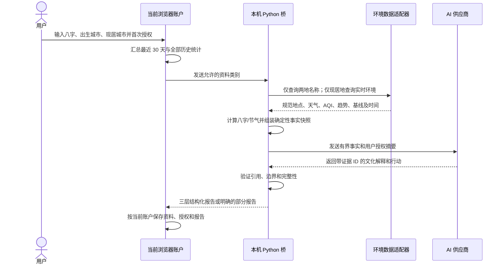
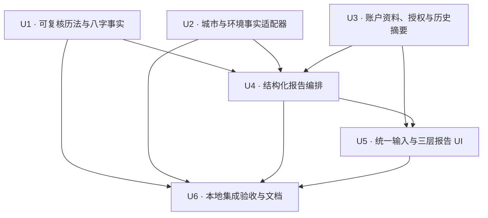

# feat: 建立证据驱动的可信问春风

## Summary

在现有 React + Python 本地优先架构内增量升级“问春风”：程序先生成可复核的八字、节气、城市环境和本地历史事实，AI 只生成带证据引用的传统文化解读与行动建议；前端以三层报告呈现依据、来源时间和不确定性，同时把出生/现居城市和统一八字输入框纳入当前账户资料。

---

## Problem Frame

当前“问春风”已经能记住八字与城市、识别图片并生成完整 Markdown 报告，但它只把八字、单一城市和问题交给生成服务：没有实时天气和空气质量，身体与学习历史没有进入报告，前后端分别维护近似节气日期，整段 Markdown 也无法证明每条建议引用了哪项事实。这使报告看起来完整，却难以让用户判断哪些内容可核验、哪些只是传统文化视角（see origin: `docs/brainstorms/2026-08-05-body-knowledge-daily-balance-requirements.md`）。

---

## Requirements

- R1/R14. 保持“今日 / 问春风 / 知识 / 我的”结构和现有学习功能，不以本轮可信度升级重写导航或学习仪表盘。
- R2. 保留八字键入、TXT/图片导入、本机图片识别、自由提问、节气、完整报告和“再问春风”，继续使用 Berich 金色、丝绸和卡片视觉。
- R3. 八字、出生城市、现居城市、授权、历史摘要、事实快照和报告必须按浏览器本地账户隔离。
- R4/R7-R10. 已有身体签到、计划、真实执行和计划偏差作为只读建议来源；真实执行优先于计划，不改变现有记录语义。
- R11/R12. 只有用户已选择的 Apple 日历可提供最近 30 天最小历史字段；不得扩大日历授权范围。
- R13. 只向各外部服务发送其完成本次操作必需的数据，服务端不持久保存个人请求、报告或图片。
- R15. 先在当前 Mac 的 `127.0.0.1:4318` 完成本地验收，本计划不部署、不改 DNS。
- R16. 首次使用时明确披露天气与 AI 两类传输及资料类别；授权按账户和用途保存，可查看、撤回或重新选择，新增类别必须重新授权。
- R17. 环境服务只接收城市查询，不请求 GPS；天气、空气质量和趋势显示来源、观测/更新时间与可用状态。
- R18. 生成前形成结构化事实快照，区分用户输入、确定性计算、外部环境事实和本地历史；缺失、过期和未知必须显式标记。
- R19. 报告固定为“可验证事实 → 传统文化解读 → 今日行动”三层，原有穿衣、方位、饮食、宜忌和问事儿能力保留在对应层内。
- R20. 每条行动必须引用当前事实快照中的证据，并显示“依据”和“需观察/不确定性”；证据不足时降低确定性或不生成。
- R21. 地域“气场”只能作为传统文化视角，讨论较易适应与需要调节的方面，不作科学测量、二元相合或确定性吉凶判断。
- R22. 自然变化建议结合准确节气、现居城市当日天气、24 小时趋势、空气质量和可用的近期气候基线，落到日常环境、活动、学习和休息调整。
- R23. 八字结构、节气、天气和历史统计由确定性程序或明确数据源产生；AI 不得创造、覆盖或改写事实。
- R24. 环境或 AI 服务失败时显示具体缺失来源和最后更新时间，并保留仍可由本地资料形成的部分报告；不得虚构实时状况。
- R25. 不生成医疗诊断、确定性灾祸或仅凭八字/地域要求迁居、投资、停药等重大决定。
- R26. 出生城市与现居城市独立保存：出生城市描述成长地域背景，现居城市决定实时环境查询，两者共同参与地域变化的传统文化对照。
- R27. 八字文字输入与 TXT/图片导入合并为一个视觉输入框；键入进入文字模式，拖入或选择素材进入导入/识别模式，识别结果回填后仍可编辑。

**Origin actors:** A1（本地账户用户）、A2（混合建议生成服务）、A3（用户已授权的 Apple 日历）、A4（公开环境数据源）

**Origin flows:** F1（身体签到与建议，作为历史来源）、F3（真实执行，作为历史来源）、F4（独立使用可信“问春风”）

**Origin acceptance examples:** AE1（账户隔离）、AE3（计划与真实执行分离）、AE4（所选日历最小字段）、AE5（报告本地保存）、AE6（本地验收前不部署）、AE7（一次授权与撤回）、AE8–AE11（证据与失败降级）、AE12（出生/现居城市语义）、AE13（统一八字输入框）

---

## Scope Boundaries

### Deferred for later

- 公网版本通过 iPhone/Mac 快捷指令连接每位用户自己的 Apple 日历。
- 将更多穿戴设备或 Apple Health 数据加入身体建议。
- 在用户明确需要后，再评估更丰富的身体趋势和长期复盘视图。
- 将现有学习或健身日历中的历史事件选择性导入 `Berich · 记录`。

### Outside this product's identity

- 不迁入“问身”的完整睡眠报告、夜间 Agent 和重型身体仪表盘；本产品保持轻量每日关照。
- 不做疾病诊断、治疗方案或医疗效果承诺。
- 不自动读取全部 Apple 日历，也不读取地点、参与人、附件或私人备注。
- 不要求用户提交 iCloud 账号专用密码来连接日历。
- 不自动生成和写入完整全天日程。
- 不把服务端用户数据库作为本轮账户或个人记录的存储方式。
- 不请求精确 GPS，不将八字、身体或学习资料发送给天气服务。
- 不把“地域气场”宣传为科学测量结果，不生成确定性吉凶、医疗诊断或重大人生决策指令。

### Deferred to Follow-Up Work

- `berichmyfriend.com` 公网部署、线上 AI 代理和跨设备日历：等待本地验收后另行规划。
- Open-Meteo 或替代环境服务的商业使用方案：本地非商业验收可使用公开端点，公网商业化前必须确认许可、配额、归属标注和付费方案。
- 加密本地资料库：当前账户仍是浏览器明文本地隔离，不在本轮升级为抵御同源脚本、恶意软件或浏览器资料访问的加密安全边界。

---

## Context & Research

### Relevant Code and Patterns

- `core/spring_wind.py` 已集中八字上下文、提示词调用和 Markdown 完整性检查，适合演进为“事实快照 + 受约束解释”编排层，而不是在 HTTP 或 React 内重写传统历法逻辑。
- `core/bazi.py` 已有干支、五行和节气帮助函数，但当前节气是固定日期近似，五行只输出日主和简单方位，且 `direction_advice` 使用“lucky/avoid”语义；可信版本需要方法说明、算法版本和独立边界样例。
- `core/ai_gateway.py` 已有注入式 HTTP transport、超时、响应上限、隐私安全错误和 JSON 输出能力，新报告合同应复用这些边界。
- `wealth_center_web.py` 已把 AI/Calendar 路由置于 loopback capability、Host/Origin/`Sec-Fetch-Site` 和请求体限制之后；环境查询和新版报告仍应保持薄适配器。
- `web/src/features/springWind/SpringWindPage.jsx` 已具备账户资料自动保存、拖放、TXT/图片、本机 Vision、供应商披露、异步结果防串号和安全 Markdown，但前端还重复维护节气与无真实天气的本地报告。
- `web/src/dailyBalance.js` 与 `web/src/localData.js` 已提供账户级规范化、备份迁移和授权版本匹配；新资料必须扩展该合同，不能建立全局 localStorage 键。
- `web/src/localBridge.js` 是浏览器到本机服务的唯一通道；新增调用继续通过该通道携带 process capability，不让浏览器直接调用第三方环境服务。
- `tests/test_ai_gateway.py`、`tests/test_bazi.py`、`tests/test_wealth_center_web.py` 和 `web/src/*.test.js` 已建立 fake transport、HTTP 适配器、纯函数和账户隔离测试模式；自动测试不得访问真实天气、Calendar 或 AI。

### Institutional Learnings

- `docs/solutions/architecture-patterns/multi-platform-core-extraction-and-frontend-splitting-2026-05-08.md` 要求把确定性业务计算放入可测试的 `core/`，外部系统各自隔离为适配器，HTTP handler 保持薄，前端复杂页面拆为小组件；本计划沿用该分层。
- 同一学习指出 I/O 必须可替换、数据演进必须向后兼容。本轮先为旧报告/旧单城市资料加迁移和特征测试，再改变结构。

### External References

- Open-Meteo [Weather Forecast API](https://open-meteo.com/en/docs)：按坐标返回当前与小时级天气，可选择温度、体感温度、湿度、降水、天气代码和风等字段。
- Open-Meteo [Geocoding API](https://open-meteo.com/en/docs/geocoding-api)：按任意语言地点名返回规范名称、行政区、国家、坐标与时区，适合让用户确认同名地点。
- Open-Meteo [Air Quality API](https://open-meteo.com/en/docs/air-quality-api)：支持当前/小时级 PM2.5 与 AQI 等环境字段。
- Open-Meteo [Historical Weather API](https://open-meteo.com/en/docs/historical-weather-api)：可按坐标获取历史日级天气，用于计算带明确样本区间的近期季节基线；不把再分析数据表述为用户实测体感。
- Open-Meteo [Terms](https://open-meteo.com/en/terms)：免费公开端点的非商业边界与商业方案必须在公网发布前重新核实，并按条款完成归属标注。
- `lunar_python` [PyPI 1.4.8](https://pypi.org/project/lunar-python/) 与 [项目文档](https://github.com/6tail/lunar-python)：MIT、无额外运行依赖，提供节气和干支工具；本计划只使用可复核的历法时间能力，不采用其黄道、吉凶或重大决策输出。

---

## Key Technical Decisions

- **新建增量计划，不重开已完成主计划：** `docs/plans/2026-08-05-001-feat-daily-balance-calendar-plan.md` 保持 completed；本计划只覆盖新增 R16–R27 及必要回归。
- **浏览器账户仍是个人资料真相源：** 出生/现居城市、授权、历史摘要和最终报告留在当前账户；Python 服务只处理一次请求，不建立个人资料库。
- **两地分别规范化：** 出生城市和现居城市都经过城市级地理匹配并显示规范名称；结果不唯一时让用户选择一次并保存。只有现居城市坐标进入实时天气、空气质量和近期气候查询，出生城市只参与地域背景对照。
- **环境服务置于本机桥后：** 浏览器不直连第三方；公开环境适配器只接收城市/规范坐标，不接收八字、问题、身体、学习或 Calendar 内容。
- **节气使用单一、版本化来源：** Python 使用固定版本 `lunar_python` 计算当前与下一节气，并用独立已知日期验证；React 删除重复固定日期表。八字五行先提供“显性天干地支计数”等可解释方法，不把藏干、旺衰、喜忌伪装成确定事实。
- **自然时间以现居地时区为准：** 当前日期、节气边界和 24 小时天气窗口使用已确认现居城市返回的 IANA 时区；环境不可用时明确退回浏览器本地时区并标记来源，不再固定假设服务器位于上海。
- **事实与解释使用不同所有者：** 程序生成带稳定证据 ID、来源、方法、时间和状态的事实；AI 响应合同没有写入或覆盖事实的字段，只能生成传统文化解释、问事回应和行动建议，并必须引用存在的证据 ID。UI 的事实卡只读程序快照，不从模型正文抽取事实。
- **证据引用还要通过类型兼容检查：** 不只验证 ID 存在，还要限制环境、身体、学习与文化行动可以引用的证据类型；模型不能拿无关事实为建议背书，也不能在行动结构中返回新的温度、AQI、时长等事实值。
- **报告改为结构化合同：** 顶层事实不可由模型填写；传统文化层保留穿衣、方位、饮食、宜忌和问事儿，但以受限 Markdown/文本承载；行动层为有界列表，包含依据、观察点和不确定性。旧 Markdown 报告继续可读，不反向重写历史内容。
- **一次授权按用途保存：** 首次面板同时说明“城市 → 环境服务”和“已选个人资料 → AI 服务”，分别记录环境查询、问春风文本生成和图片识别授权；以后默认使用已授权类别，用户可在“问春风”或“我的”撤回。
- **近期细节与长期汇总并存：** 发送给生成服务的个人上下文只含最近 30 天的有界明细/趋势及全部历史汇总，不发送完整账户、完整备份或无限原始记录；Calendar 仍限用户所选日历和五个允许字段。
- **环境变化区分当前、趋势和基线：** 当前/24 小时预测直接标记为天气数据；近期气候基线使用公开历史数据计算并标记样本区间，不称为永久气候定论或个人体感。
- **失败返回部分报告，而非伪造完整报告：** 环境失败时事实层显示缺失/过期，AI 不得补天气；AI 失败时仍展示可用事实和确定性本地提示，不再使用 React 内的通用文学化 `localReport` 假装掌握当日温差。
- **统一输入框采用显式模式状态：** 同一个视觉容器承载可编辑八字文本、拖放和文件操作；键入、拖入、识别中、识别失败和回填编辑是可恢复状态，模式切换不清空已保存文本。

### Data destination matrix

| Data | Browser account | Environment provider | AI provider |
|---|---|---|---|
| 八字、出生/现居城市原始文本 | 保存 | 仅城市查询文本/规范坐标 | 经授权后发送本次所需字段 |
| 当前天气、AQI、趋势、气候基线 | 随报告保存 | 由其返回 | 作为带来源事实发送 |
| 身体/学习/真实执行历史 | 最近 30 天摘要与全量汇总 | 从不发送 | 经授权后发送有界摘要 |
| Apple 日历 | 只保存选择与必要摘要 | 从不发送 | 仅用户已选日历的允许字段或本地汇总 |
| 图片 | 不写入账户 | 从不发送 | 仅本机 Vision 不可用且用户单独授权时临时发送 |
| 报告 | 当前账户保存 | 从不发送 | 供应商只返回生成结果；本机服务不持久保存 |

---

## Open Questions

### Resolved During Planning

- **历史使用多少？** 最近 30 天保留有界细节，并附全部历史汇总；不发送无限原始记录。
- **同名城市怎样处理？** 不静默猜测；用户选择一次规范地点并按账户记住。
- **出生城市与现居城市如何分工？** 出生城市用于地域背景，现居城市决定实时环境，两地共同参与变化对照。
- **文字与素材输入怎样呈现？** 合并成一个混合输入框，由用户当前动作切换文字/识别模式。
- **环境数据从哪里来？** 本地版本先通过可替换 Open-Meteo 适配器获取地理匹配、天气、AQI 和近期基线，所有事实显示来源和时间。
- **如何避免 AI 改写事实？** 程序拥有事实层，AI 只返回受验证的解释和带证据 ID 的行动；无效引用不能展示。
- **如何提高节气准确性？** 使用固定版本历法库作为唯一计算源，并用独立边界样例校验；不复用其吉凶能力。

### Deferred to Implementation

- **Open-Meteo 具体免费额度、归属文案和商业许可：** 本地实现按当前官方条款接入并保留 provider abstraction；任何公网部署前必须重新核实，若不适用则更换为合规供应商。
- **城市搜索的排序细节：** 先按名称、国家/行政区与语言结果做确定性排序，再用北京/通州、同名城市和海外城市 fixture 调整；不得以运行时猜测绕过用户确认。
- **外部历史数据基线的成本：** 实现时在 fake transport 下确定最小样本区间、响应大小和缓存 TTL；若公开端点无法稳定支持，事实层必须明确标记基线缺失，而不是回退为 AI 常识。
- **AI 供应商对 JSON response format 的兼容差异：** 复用现有 fake transport 先固化验证合同，再对当前已配置供应商做一次用户同意的最小 smoke test；不在计划中假定所有兼容端都完全一致。

---

## High-Level Technical Design

> *This illustrates the intended approach and is directional guidance for review, not implementation specification. The implementing agent should treat it as context, not code to reproduce.*

环境数据源看不到八字或个人历史；AI 看不到完整账户或备份；浏览器仍是唯一持久保存个人报告和账户资料的地方。

---

## Implementation Units

### U1. 建立可复核的历法与八字事实

**Goal:** 把八字解析、显性五行分布、当前/下一节气和计算方法整理成稳定事实项，替代近似日期和“吉/忌”式确定性字段。

**Requirements:** R18, R21, R23, R25; F4; AE8, AE10

**Dependencies:** None

**Files:**
- Modify: `core/bazi.py`
- Modify: `requirements.txt`
- Modify: `tests/test_bazi.py`

**Approach:**
- 固定 `lunar_python` 版本，只使用节气、时间与干支基础能力；不调用黄道、冲煞、吉神或重大决策相关输出。
- 对用户提供的四柱做严格、可恢复解析，分别统计显性天干和地支五行；事实说明该计数不含藏干、旺衰、强弱或“喜用神”，避免把简化算法包装为完整命理结论。
- 输出稳定事实 ID、算法/数据版本、输入时区、计算时间、当前与下一节气边界；缺柱时标记不完整，不用当日干支冒充用户日主。时区由 U4 使用 U2 的现居地点结果显式传入，不在纯函数内读取服务器默认时区。
- 将现有 `direction_advice` 的 `lucky/avoid` 结果从事实层移除；如传统文化层需要方位，只能由 U4 以文化解释并引用明确基础事实。
- 删除前端重复节气表由 U5 完成；本单元保持 Python 为唯一确定性历法来源。

**Execution note:** 先为当前解析行为和已知节气边界增加特征/校验测试，再替换近似算法。

**Patterns to follow:**
- `core/bazi.py` 的纯函数边界和 `tests/test_bazi.py` 的明确日期注入。
- `core/rewards.py` / `core/stats.py` 的无 I/O 可测试计算模式。

**Test scenarios:**
- Happy path: 完整“甲戌 壬申 己丑 丁卯”解析为四柱、日主和显性五行计数，并附方法说明与版本，不输出喜用神或科学化结论。
- Edge case: 只有两柱、重复标点、带“年月日时”、空白或非法字符时，返回明确完整度/校验错误，不借用当天干支填充用户八字。
- Boundary: 在两个已知节气切换点前后一分钟计算，当前/下一节气和本地日期正确，不受服务器 UTC 日期影响。
- Timezone: 同一节气瞬间在北京与海外现居地使用各自本地日期显示；环境时区缺失时的 fallback 来源被显式标记。
- Regression: 同一输入和同一时间产生一致事实 ID/值；算法版本变化可被报告识别，不静默覆盖旧报告事实。
- Safety: 事实快照不包含“必然、灾、绝对相合、必须迁居”等确定性吉凶字段。

**Verification:**
- 八字和节气测试以独立 fixture 通过；事实层能解释算法范围，React 不再需要第二套近似节气计算。

### U2. 增加城市规范化与环境事实适配器

**Goal:** 只用城市级信息获取可追溯的地点、现居天气、空气质量、24 小时趋势和近期气候基线，并在失败时返回可解释的部分结果。

**Requirements:** R17, R18, R21, R22, R24, R26; A4; F4; AE8, AE9, AE12

**Dependencies:** None

**Files:**
- Create: `core/environment.py`
- Create: `tests/test_environment.py`

**Approach:**
- 建立注入式环境 transport，分别封装地点搜索、天气、空气质量和历史基线；生产 transport 使用固定 HTTPS 主机、短超时、响应大小上限、明确 User-Agent 和隐私安全错误码。
- 出生与现居城市都搜索规范地点候选；唯一高置信匹配可直接显示确认，多个合理候选返回 `needs_confirmation`，不静默选第一个。
- 只有已确认的现居地点进入天气/AQI/历史请求；出生地点只输出规范名称、行政区、国家、时区与大致地理关系，不读取“出生地今日天气”。
- 当前事实包含温度、体感、湿度、降水/概率、天气代码、风和可用的 AQI/PM2.5；趋势限定近期并统一到地点时区。
- 气候基线使用公开历史数据的有限、明确样本区间计算简单季节统计，附样本年份与覆盖率；它是近期基线，不称为个人体感或永恒城市属性。
- 历史请求只选择计算基线必需的日级变量并设置独立响应上限、低频缓存和覆盖率门槛；配额、许可或响应成本不合适时，基线单独降级为 missing，不阻塞当前天气/AQI。
- 只在内存缓存公开地点/环境数据，按不同新鲜度过期；缓存不含八字、用户问题、账户 ID 或身体/学习信息。可使用过期缓存时必须标记 stale 和最后更新时间。
- 响应中始终携带数据源、归属信息、观测/抓取时间和每个字段的 available/missing/stale 状态。
- 地点结果必须包含可验证 IANA 时区并交给报告编排；缺失/非法时区单独降级，不能静默继续使用服务器时区。

**Patterns to follow:**
- `core/ai_gateway.py` 的注入式 transport、超时、响应上限和隐私安全错误映射。
- `core/calendar_sync.py` 的外部系统适配器隔离与 fixture runner 测试。

**Test scenarios:**
- Happy path: 成都出生、北京现居得到两个规范地点，但只有北京触发天气、AQI 和基线请求；返回字段均带来源/时间/单位。
- Covers AE12. 断言成都天气不会出现在当前环境，环境 transport 请求体/URL 中没有八字、问题、账户、身体或学习字段，也没有 GPS。
- Ambiguity: “通州”等多候选地点返回可选择列表；用户确认北京通州后使用该规范位置，后续相同 provider/version 不再要求选择。
- Covers AE8. fixture 返回降温、大风和较差空气质量时，事实层保留原始值、单位和时间供行动引用。
- Covers AE9. 天气超时但本地/缓存事实存在时返回 partial/stale；无缓存时明确 missing，绝不生成“正在下雨”等值。
- Edge case: 时区、午夜跨日、空 AQI、未知天气代码、部分小时缺值和低历史覆盖率都保持结构有效并降低可用性。
- Resource/security: 非 HTTPS 重定向、非允许主机、过大/无效 JSON、超时和并发失败映射为通用状态，日志不含城市之外的个人内容。
- Cache: 当前天气与历史基线使用不同 TTL；过期条目不会伪装成当前观测，缓存键不包含账户 ID。

**Verification:**
- 全部环境测试使用 fake transport 且无真实网络；两地语义、来源时间、失败降级和数据最小化均可由测试证明。

### U3. 演进账户资料、用途授权与历史摘要

**Goal:** 在不破坏现有本地数据的前提下保存出生/现居城市与地点选择，按用途管理一次授权，并为“问春风”构建最近 30 天细节加全部历史汇总的最小上下文。

**Requirements:** R3, R4, R7-R13, R16, R18, R26; F1, F3, F4; AE1, AE3-AE5, AE7, AE11, AE12

**Dependencies:** None

**Files:**
- Create: `web/src/springWindContext.js`
- Create: `web/src/springWindContext.test.js`
- Modify: `web/src/dailyBalance.js`
- Modify: `web/src/dailyBalance.test.js`
- Modify: `web/src/localData.js`
- Modify: `web/src/localData.test.js`
- Modify: `web/src/features/today/TodayPage.jsx`

**Approach:**
- 把旧 `profile.city` 迁移为 `current_city`，保留原文字且不猜出生城市；新增 `birth_city`、两地规范候选选择及 provider/version，旧报告继续可读。
- 将当前单一 `consent.text/image` 演进为按用途保存的授权集合，使每日建议、问春风、环境查询和图片识别互不覆盖；兼容旧授权但字段版本或接收方变化时重新披露。
- 同步迁移“今日”页的授权读取/写入，使 daily-advice 继续使用自己的用途键；问春风授权不能使每日建议误判已同意，反之亦然。
- 授权记录保存已允许的资料类别、接收方、字段/条款版本、时间和撤回状态；图片本机识别不误标为外部上传授权。
- 建立纯函数上下文构建器：身体与执行取最近 30 天有界明细/趋势，学习任务和完成记录取同一窗口，全部历史只输出计数、分钟和计划偏差等汇总；自由文字设长度和数量上限。
- Apple Calendar 事件只接受现有桥返回的五个允许字段，并在浏览器内先汇总；不得把整个账户、backup、projection 状态或未选日历传给报告接口。
- 上下文携带 manifest，列出 included/omitted 类别、覆盖日期和样本量，让报告可以诚实显示“依据了什么”和“缺少什么”。
- 备份保留个人资料和历史报告，但沿用现有安全边界重置外部授权；规范地点可按 provider/version 重新验证，不能把导入设备的旧授权视为仍有效。

**Execution note:** 先加入旧 `city`、旧授权和旧 Markdown 报告迁移 fixture，再修改 normalizer 和存储 API。

**Patterns to follow:**
- `normalizeDailyBalanceState`、`preparePortableDailyBalance` 和 `consentMatches` 的向后兼容模式。
- `createDailyBalanceAPI` 的账户锁、原子写入和 `web/src/localData.test.js` 的双账户 fixture。

**Test scenarios:**
- Migration: 旧资料 `{city: "北京 通州"}` 迁移为现居城市，出生城市为空，旧报告仍显示且下一次保存不丢失八字/问题。
- Covers AE1/AE7. Jane 的两地、授权、摘要和报告不会出现在 Friend；Jane 撤回问春风授权后下一请求不再包含个人历史。
- Authorization: 首次允许全部已列类别后可复用；新增字段类别、接收方或条款版本变化使旧授权失效并重新询问，环境/AI/图片授权互不覆盖。
- Daily-advice regression: 已有“今日”文本授权迁入 daily-advice 用途后继续有效；新授予/撤回问春风权限不改变今日建议的授权状态或 payload。
- Covers AE3/AE11. 40 分钟计划、25 分钟真实学习在最近窗口中保留 -15 分钟偏差；只有两次真实记录时样本量为 2，不生成“连续七天”的数据。
- Windowing: 30 天内保留有界明细，窗口外只进入全量汇总；大量历史不会使请求无限增长。
- Data minimization: 输出不含账户密码/哈希、完整 backup、未选日历、Calendar 地点/参与人/备注、projection token 或无限自由文字。
- Covers AE12. 出生/现居城市和各自规范地点独立往返保存，现居地变化不会覆盖出生地。
- Backup: 导入保留两地原始文字与报告，清除用途授权和设备相关选择；失败导入保持原账户不变。

**Verification:**
- 现有本地数据、双账户隔离和备份测试继续通过；新上下文的大小、字段和覆盖区间可预测且可向用户解释。

### U4. 构建结构化事实快照与受约束报告编排

**Goal:** 将历法、环境和授权后的个人摘要组合为程序拥有的事实层，并让 AI 只返回可验证引用的文化解释与行动，支持清晰的部分失败。

**Requirements:** R13, R18-R25, R26; A2, A4; F4; AE8-AE12

**Dependencies:** U1, U2, U3

**Files:**
- Modify: `core/spring_wind.py`
- Modify: `core/ai_gateway.py`
- Modify: `prompts/spring-wind.md`
- Modify: `wealth_center_web.py`
- Modify: `tests/test_ai_gateway.py`
- Modify: `tests/test_wealth_center_web.py`

**Approach:**
- 报告入口严格校验八字、两地、问题、授权 manifest、个人摘要和可选地点选择；限制嵌套深度、数组长度、文字长度和请求体大小。
- 由服务端为用户输入、U1 历法/八字、U2 环境和 U3 历史分别生成事实项；AI 请求只包含目的允许字段和这些事实，不允许模型产生顶层事实数组。
- AI 使用结构化 JSON 合同输出传统文化章节、可选问事回应和有界行动项；合同不接受模型返回事实数组或来源时间，每个结论/行动必须引用事实 ID，并明确 `traditional_culture`、依据、需观察/不确定性。
- 服务器验证必需章节、引用存在、证据类型与行动类型兼容、数量/长度、允许内容类型和免责声明；未知/无关证据 ID、模型提供新的结构化事实值、把缺失天气当作行动依据、确定性灾祸/诊断/重大指令或合同不完整时拒绝该项或整次解释，不影响事实层返回。
- 保留原有穿衣、方位、饮食、宜忌和问事儿能力，但把“吉凶方位”呈现为明确传统文化的方位观察，不输出“绝对相合/不相合”。
- AI 不可用时返回事实层和有来源的本地基础提示；天气不可用时仍可生成明确缺失天气的文化层，但行动不得引用不存在的天气。
- 报告元数据记录事实快照版本、算法版本、环境来源/时间、AI provider/model、生成时间和 complete/partial 状态；服务器不写文件、不记录个人 body 或 raw provider response。
- 现有旧 Markdown 报告无需迁移为新结构；前端根据 report version 选择旧安全 Markdown 或新三层渲染。

**Execution note:** 先用 fake transport 固化事实所有权、证据引用和失败合同，再修改提示词；不得以 live 模型输出来定义接口。

**Patterns to follow:**
- `build_daily_context` / `validate_daily_advice` 的 allowlist 与结构验证。
- `AIProviderError` 的隐私安全错误和 `wealth_center_web.py` 的薄 handler。
- `SafeMarkdown` 的固定节点/协议白名单继续用于传统文化文本。

**Test scenarios:**
- Happy path: 完整八字、成都出生、北京现居、30 天身体/学习摘要和环境 fixture 生成三层报告，旧五个功能章节可找到且行动引用有效事实 ID。
- Covers AE8. “减少室外高强度活动”引用大风/AQI 事实并带观测时间和“按实际体感调整”，而不是只写无来源结论。
- Covers AE9. 环境失败返回 partial，事实层显示 unavailable/last-updated；模型即使声称“正在下雨”也不能让该说法进入有效行动。
- Covers AE10. 地域解释比较成都背景与北京当前环境，可以讨论适应/调节，但绝不输出城市绝对不合或迁居指令。
- Covers AE11. 模型把两次学习写成连续七天时，验证结果不把该句作为有效事实/行动；事实层仍显示样本量 2。
- Evidence validation: 未知、重复或 missing 证据 ID，空依据，过多行动，超长内容和非法结构均被拒绝或降级，程序事实原样返回。
- Evidence compatibility: 学习行动只能引用允许的学习/精力/时间证据组合；只引用无关衣着颜色或出生地标签的学习行动被拒绝，模型提供的温度/AQI/分钟值不会进入事实卡。
- Privacy: fake AI payload 不含完整账户、密码、backup、未选日历字段、环境 transport 配置或未经授权类别；失败日志不含八字、城市、身体文字、日历标题或模型回显。
- Safety: 医疗诊断、停药、确定性灾祸、投资/迁居命令和科学化“气场测量”输出不能成为有效建议。
- Backward compatibility: 旧版 Markdown 报告仍能读取；新版报告失败不会删除上一次成功报告或已保存资料。
- HTTP: capability、Origin/Host、大小限制和错误映射覆盖新版地点/报告流程，未授权请求不会触发环境或 AI transport。

**Verification:**
- 相同事实输入产生相同事实层；AI 只能影响解释/行动，所有显示建议都能回指有效证据，服务端无个人内容持久化。

### U5. 重做统一八字输入与三层可信报告界面

**Goal:** 在保持 Berich 视觉与全部输入能力的同时，把截图中分离的文字框/素材框合成一个输入面，加入两地资料、一次授权、地点确认和可追溯报告展示。

**Requirements:** R2, R3, R16-R20, R24, R26, R27; A1; F4; AE5, AE7-AE13

**Dependencies:** U3, U4

**Files:**
- Create: `web/src/features/springWind/BaziMaterialInput.jsx`
- Create: `web/src/features/springWind/SpringWindReport.jsx`
- Create: `web/src/features/springWind/springWindInputState.js`
- Create: `web/src/features/springWind/springWindInputState.test.js`
- Modify: `web/src/features/springWind/SpringWindPage.jsx`
- Modify: `web/src/features/account/MyPage.jsx`
- Modify: `web/src/localBridge.js`
- Modify: `web/src/localBridge.test.js`
- Modify: `web/src/App.jsx`
- Modify: `web/styles.css`

**Approach:**
- 用一个有清晰焦点状态的输入卡承载可编辑 textarea、轻量拖放提示和底部文件操作；删除第二个大面积虚线素材框，但保留整页拖放能力。
- 纯状态 reducer 管理 idle/text/importing/recognizing/error/editable-result；开始键入立即进入 text，拖入/选择素材进入导入/识别，成功结果回填为可编辑文字，失败恢复原文字并保留重试。
- 出生城市和现居城市各自显示规范匹配；候选唯一时显示“按何地查询”，候选不唯一时让用户选择一次。天气卡明确只标注现居地，地域对照同时标注两地角色。
- 首次授权面板列出接收方、资料类别和覆盖窗口；以后显示“本次将使用”摘要，并提供查看/撤回入口。“我的”页提供相同授权管理，不让用户必须清空账户才能撤回。
- 生成前先在浏览器构建 U3 有界摘要并读取已选 Calendar 最小历史；只将授权 manifest 和允许字段交给本机桥。账号切换、取消和旧响应继续由 request/account ownership 防护。
- 新报告组件分别渲染事实、传统文化与今日行动：事实显示来源/时间/状态，文化层显示明显标签，行动展开可查看依据和不确定性；partial/stale/missing 使用不同状态而不是模糊失败文案。
- 删除 React 内 `JIEQI` 和通用 `localReport`，统一使用服务端事实版本；桥不可用时保留已保存报告和输入，并明确本机服务状态。
- 新旧报告并存：旧版继续经过 `SafeMarkdown`，新版文化文本也经过同一 allowlist；模型 HTML、图片、iframe、SVG、样式和危险 URL 仍不可渲染。

**Patterns to follow:**
- 现有页面的 profile debounce 保存、object URL 清理、document-level 拖放和 request ID 防串号。
- `web/styles.css` 的 Berich 卡片、金色层级、响应式、键盘焦点和 reduced-motion 规则。
- `web/src/localBridge.js` 的 process capability 和隐私安全错误映射。

**Test scenarios:**
- Covers AE13. 聚焦统一框键入时保持文字模式且无上传；拖入受支持图片时同框进入识别，结果回填可编辑，DOM/视觉不再出现两个并列大输入边框。
- Input edge: 已有手写文字时图片识别失败，原文字仍在；TXT 导入、图片选择、拍照、全页拖放和重复文件选择继续工作。
- Race: 识别/报告进行中切换账户或离开页面，旧响应不能覆盖新账户或已经修改的文字，object URL 被释放。
- Covers AE12. 成都出生、北京现居分别自动保存并显示；报告天气卡只显示北京来源，地域卡清楚标注两地角色。
- Location ambiguity: 用户选定“北京·通州”后按账户记住；修改现居文字使旧规范匹配失效并重新确认，不影响出生城市。
- Covers AE7. 首次授权后后续生成不重复询问；撤回身体历史类别后“本次将使用”和发送 payload 都不再包含它，新类别/条款版本触发重新披露。
- Report: 完整/部分/过期事实有明确 badge；每个行动可展开看到依据 ID 对应的事实和观察点，传统文化层不伪装成事实。
- Error path: 天气、AQI、AI 或本机桥分别失败时保留输入/上次报告并显示哪个来源不可用，不出现伪造的当前天气。
- Security: 新版文化文本继续使原始 HTML、脚本、图片及危险链接惰性化，外部安全链接保留必要 rel 属性。
- Accessibility/responsive: 统一输入框、候选选择、授权面板、三层报告和折叠依据可键盘操作，有可读标签/实时状态，在桌面和窄屏不重现大块空白素材框。

**Verification:**
- 用户从键入或拖图到两地确认、一次授权、生成和查看依据可在同一页面完成；旧功能无损，截图指出的双框问题消失。

### U6. 完成本地集成验收、隐私说明与回归验证

**Goal:** 证明可信报告的事实所有权、隐私边界、失败降级、账户隔离和新输入体验在当前 Mac 可用，并保持线上未变。

**Requirements:** R1-R3, R11-R27; F4; AE1, AE3-AE13

**Dependencies:** U1, U2, U4, U5

**Files:**
- Modify: `README.md`
- Modify: `privacy.html`
- Modify: `docs/DEPLOY_BERICHMYFRIEND.md`
- Test: `tests/test_bazi.py`
- Test: `tests/test_environment.py`
- Test: `tests/test_ai_gateway.py`
- Test: `tests/test_wealth_center_web.py`
- Test: `web/src/springWindContext.test.js`
- Test: `web/src/features/springWind/springWindInputState.test.js`
- Test: `web/src/dailyBalance.test.js`
- Test: `web/src/localData.test.js`
- Test: `web/src/localBridge.test.js`

**Approach:**
- 文档说明两类外部接收方、两地用途、30 天细节/全量汇总、天气归属与更新时间、传统文化边界、授权撤回和本地账户明文边界。
- 自动测试全部使用历法 fixture、环境 fake transport 和 AI fake transport；不读取真实 Calendar，不调用真实天气或 AI。
- 在浏览器用非敏感 fixture 完成桌面/移动回归：统一输入、两地匹配、完整/partial 报告、依据展开、撤回授权、账户切换、旧报告和知识页。
- 用户明确同意后，才可用公开测试城市做一次最小环境 smoke test；真实八字、身体历史和学习历史不用于验证第三方天气接口。AI live smoke test仍受现有供应商披露和用户同意约束。
- 保留 `127.0.0.1:4318`、loopback capability、CSP 和无第三方运行脚本边界；不得部署、修改 DNS 或把 Open-Meteo 非商业公开端点直接带入商业线上版本。

**Test scenarios:**
- Covers AE8-AE11. 完整、天气失败、错误模型陈述、样本不足和地域过度结论都按结构化合同显示或被拒绝。
- Covers AE1/AE5/AE7/AE12. 两个本地账户的两地、授权、历史与报告完全隔离；备份/导入按既有边界重置外部授权。
- Covers AE13. 在与用户截图相同的桌面宽度确认单一混合输入面；键入、拖图、TXT、选择图片/拍照和识别回填均可用。
- Regression: 今日签到、真实完成、知识任务、Calendar 选择、登录/退出、数据备份和旧 Markdown 报告继续工作。
- Privacy inspection: 环境请求只有城市/规范坐标，AI 请求只有授权摘要，日志/静态 bundle/跟踪文件没有个人内容、provider key 或完整账户。
- Failure matrix: 本机桥停止、天气超时、AQI 缺失、AI 未配置/超时、地点歧义和 localStorage 写入失败都有可恢复路径且不删除上次成功报告。
- Attribution: 环境事实和页面/隐私说明显示供应商、时间和条款要求的归属；stale 数据绝不显示为“刚刚更新”。
- Accessibility: 键盘、屏幕阅读标签、焦点、错误提示、reduced motion 和移动宽度覆盖新增交互。
- Covers AE6. 验收前确认无部署、无 DNS 变化、无公开线上环境调用。

**Verification:**
- Python/JavaScript 自动测试与静态构建通过，浏览器场景满足 AE1、AE3-AE13，用户能在本地看到证据来源和统一输入框，线上服务保持未变。

---

## System-Wide Impact

- **Interaction graph:** React 从账户存储构建有界个人摘要，经同源 loopback bridge 进入 Python；Python 分别调用历法纯函数、环境适配器和 AI gateway，再把结构化报告返回当前账户。Apple Calendar 仍由现有独立桥提供用户已选最小历史，不参与天气请求。
- **Error propagation:** 地点歧义是等待用户确认，环境缺失是 partial/stale，AI 失败保留事实层，本机桥失败保留输入/旧报告；任何外部失败都不能被压成一条无来源的“生成失败”或伪造完整报告。
- **State lifecycle risks:** 旧单城市迁移、两地文字与规范结果失配、授权版本变化、账户切换时异步响应、识别模式切换、报告版本并存和 localStorage quota 都可能造成资料串写或丢失；通过账户锁、版本/用途键、request ownership、原子写和旧报告只读兼容控制。
- **Trust boundaries:** 环境供应商只看城市/坐标；AI 只看授权、有界事实；本机服务不持久保存；报告文本继续按安全 Markdown allowlist；本地账户仍是明文便利隔离而非加密认证。
- **API surface parity:** 本轮只改本地 React + Python 网页链路。iOS、Mini Program、CLI、桌面 overlay 和公网静态版不获得可信“问春风”外部环境能力，直到后续计划明确处理。
- **Integration coverage:** 纯函数测试证明摘要/历法，fake transport 证明环境/AI 边界，HTTP 测试证明 capability 与输入限制，浏览器验收证明统一输入和三层报告；任何单层测试都不能替代完整链路检查。
- **Unchanged invariants:** 现有学习任务、身体签到、双日历语义、图片本机识别、账户登录与备份继续工作；本计划不写 Calendar、不部署、不建立服务端用户数据库。

---

## Risks & Dependencies

| Risk | Mitigation |
|---|---|
| 同名城市匹配错误导致天气与地域解读对象错误 | 候选不唯一时必须用户选择；报告始终显示规范地点、行政区和国家，修改原文字使旧选择失效 |
| Open-Meteo 免费端点不适合未来商业公网使用 | 环境 provider 可替换；本地先验收，公网前重新核实许可/配额/归属并采购或替换 |
| 历史基线请求过大、过慢或消耗过多公开额度 | 只取日级必要字段、限制样本和响应、单独低频缓存；失败仅移除基线，不阻塞当前天气且不让 AI 补写 |
| 历史天气样本被误称为城市永恒气候 | 标注样本区间、覆盖率和“近期基线”，低覆盖直接缺失，不进入确定性行动 |
| `lunar_python` 与独立历法来源边界不一致 | 固定版本、已知节气 fixture、算法版本入报告；只用时间能力，不采用其吉凶结论 |
| 简化五行计数被用户理解成完整命理判断 | 事实层明确“显性干支计数、不含藏干/旺衰/喜用”，复杂传统解释放在文化层并说明不确定性 |
| 模型引用证据但在正文中扭曲数值或因果 | 程序独占事实卡；行动必须引用有效 ID，事实冲突项拒绝/降级，UI 不把模型叙述显示为事实 |
| “使用所有信息”导致过度传输敏感历史 | 最近 30 天有界摘要 + 全量汇总、用途授权、manifest、长度上限和 captured-payload 测试 |
| 旧 `city`/授权/报告迁移导致数据丢失 | 迁移优先 fixture、旧城市只映射现居、出生地留空、旧报告只读兼容、原子写与备份回归 |
| 合并输入框破坏桌面拖放或覆盖手写内容 | 纯 reducer 管理模式，识别失败恢复原文，document-level 拖放与文件路径回归，浏览器按截图宽度验收 |
| 外部服务故障让报告看似仍然完整 | complete/partial/stale/missing 状态逐项显示；禁止前端文学化 fallback 虚构环境事实 |
| AI 或环境错误日志泄露个人资料 | 通用错误码、禁止 body/raw provider 日志、fake failure 捕获测试和现有 loopback capability 边界 |

---

## Phased Delivery

### Phase 1 — 事实与账户基础

- U1 可复核历法/八字事实。
- U2 城市与环境事实适配器。
- U3 两地资料、用途授权与本地历史摘要。

### Phase 2 — 可信生成合同

- U4 结构化事实、证据引用、传统文化解释和部分失败。

### Phase 3 — 用户体验

- U5 统一八字输入框、两地确认、一次授权与三层报告。

### Phase 4 — 本地验收

- U6 自动、浏览器、隐私、归属和回归验证。
- 用户验收后停止；本计划不继续到公网部署。

---

## Success Metrics

- 用户填写一次出生/现居城市后，后续报告能明确区分成长地域与当前环境；同名地点不会被静默猜错。
- 八字键入、TXT、图片拖放和文件选择在同一个视觉输入面完成，识别结果可继续编辑。
- 每份新版报告都能把事实、传统文化和行动区分开；每条行动可回看至少一项存在的证据、来源时间和不确定性。
- 天气/AQI/AI 任一不可用时，页面准确显示缺失或过期，不虚构当前环境，也不删除已保存输入和上次报告。
- 两个浏览器账户的资料、授权、摘要和报告保持隔离；外部 captured payload 不包含未授权类别或完整账户。
- 本地自动测试、静态构建和桌面/移动浏览器验收通过，`berichmyfriend.com` 与 DNS 保持未变。

---

## Documentation / Operational Notes

- `README.md` 说明本地环境能力、两地语义、环境供应商、公开测试方法和不使用真实个人资料的 smoke-test 方式。
- `privacy.html` 列出环境与 AI 两类接收方、各自字段、30 天窗口/全量汇总、撤回路径、报告保存位置和本地明文边界。
- `docs/DEPLOY_BERICHMYFRIEND.md` 增加环境服务商业许可/归属、线上代理、速率限制和跨设备账户的部署前置检查，但不在本计划执行部署。
- UI 报告显示环境归属、数据/算法版本和时间；传统文化与非医疗/非决策声明放在实际解释附近，而不只放页脚。
- 实施交接必须记录是否进行了任何真实环境/AI smoke test、使用了哪个非敏感测试城市、调用时间和结果；不得记录用户八字或个人历史。

---

## Sources & References

- **Origin document:** [`docs/brainstorms/2026-08-05-body-knowledge-daily-balance-requirements.md`](../brainstorms/2026-08-05-body-knowledge-daily-balance-requirements.md)
- Prior completed plan: [`docs/plans/2026-08-05-001-feat-daily-balance-calendar-plan.md`](2026-08-05-001-feat-daily-balance-calendar-plan.md)
- Institutional pattern: [`docs/solutions/architecture-patterns/multi-platform-core-extraction-and-frontend-splitting-2026-05-08.md`](../solutions/architecture-patterns/multi-platform-core-extraction-and-frontend-splitting-2026-05-08.md)
- Related backend: `core/bazi.py`, `core/spring_wind.py`, `core/ai_gateway.py`, `wealth_center_web.py`
- Related frontend: `web/src/features/springWind/SpringWindPage.jsx`, `web/src/dailyBalance.js`, `web/src/localData.js`, `web/src/localBridge.js`
- Related tests: `tests/test_bazi.py`, `tests/test_ai_gateway.py`, `tests/test_wealth_center_web.py`, `web/src/localData.test.js`, `web/src/dailyBalance.test.js`, `web/src/localBridge.test.js`
- External environment docs: <https://open-meteo.com/en/docs>, <https://open-meteo.com/en/docs/geocoding-api>, <https://open-meteo.com/en/docs/air-quality-api>, <https://open-meteo.com/en/docs/historical-weather-api>, <https://open-meteo.com/en/terms>
- External traditional-calendar library: <https://pypi.org/project/lunar-python/>, <https://github.com/6tail/lunar-python>
