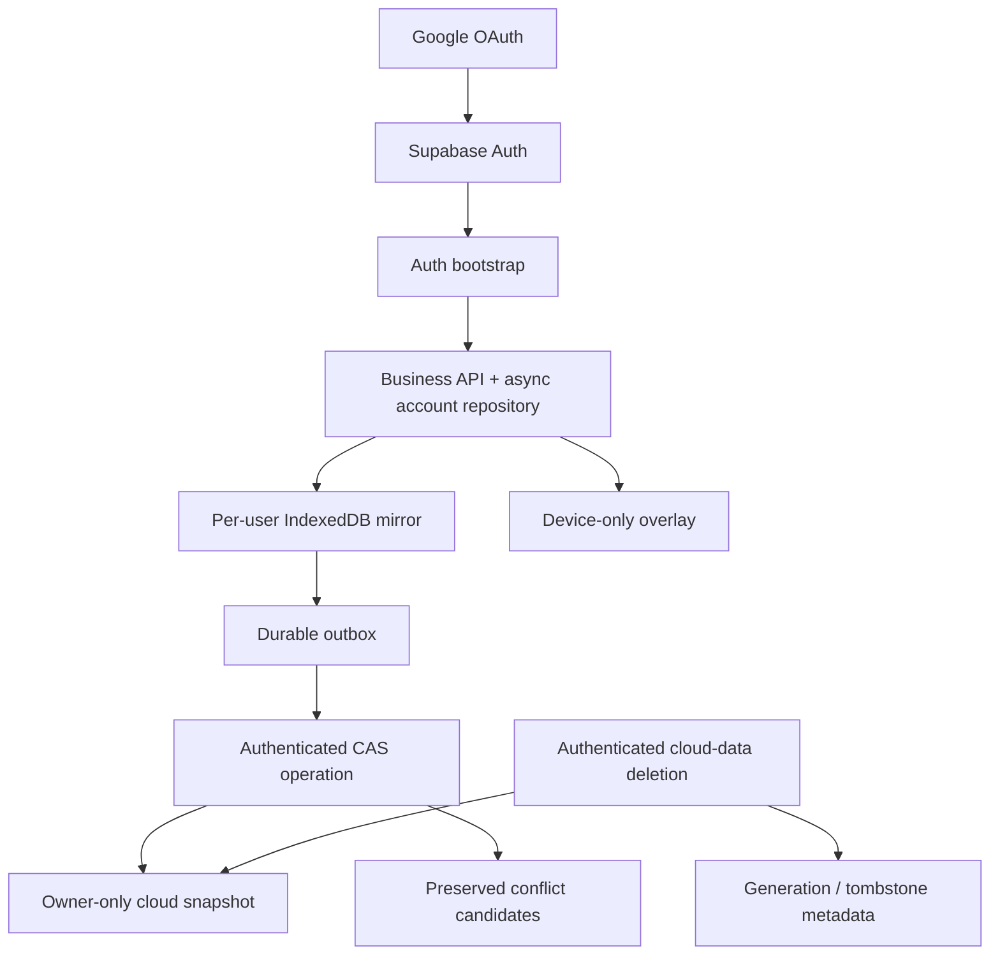
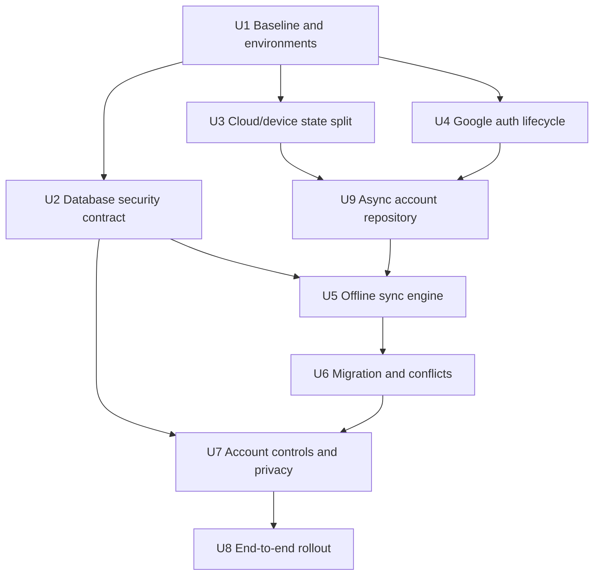
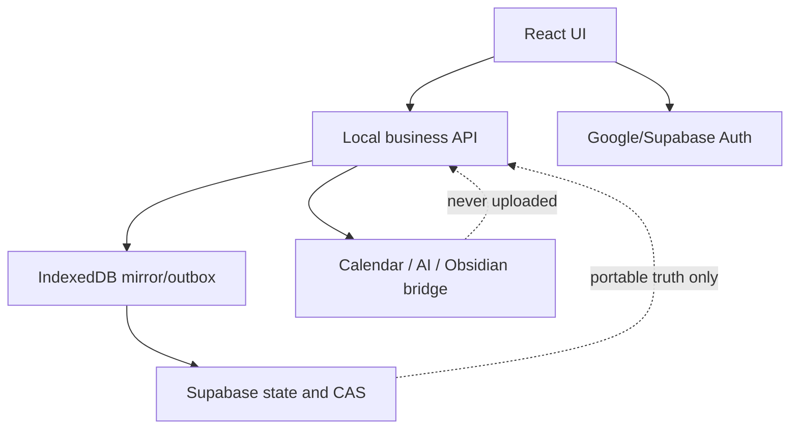

# feat: Add Google authentication and cloud sync

## Summary

Add a Supabase-backed authentication and synchronization layer around the existing local business APIs. Use Google OAuth with PKCE, a per-user cloud snapshot protected by server-side revision checks, an IndexedDB outbox for offline work, and a separate device overlay for Calendar, AI and Obsidian-only state.

---

## Problem Frame

The production site currently treats an email-shaped local username as an account, but the account and all data exist only in one browser. A password change succeeds in that browser yet cannot authenticate elsewhere because there is no shared identity or cloud data store (see origin: `docs/brainstorms/2026-09-10-google-cloud-sync-requirements.md`).

---

## Requirements

- R1. Add Google login for every Google user.
- R2. Isolate each Google identity's learning, body, Spring Wind, knowledge and account data from every other user.
- R3. Persist and refresh the Google session across normal browser restarts until logout, provider revocation or security expiry.
- R4. Hide account data after logout and require the same identity to be verified before it is shown again.
- R5. Before legacy migration, show a content-free summary containing categories, counts and latest timestamps.
- R6. Upload legacy data only after explicit confirmation; cancellation leaves the original local state unchanged.
- R7. Show and confirm the active Google email before migration so data is not assigned to the wrong identity.
- R8. Preserve local-password accounts and JSON backup/import until migration is verified, without changing totals, task state or reports.
- R9. Synchronize portable learning, body, Spring Wind, knowledge and review data with the Google identity.
- R10. Automatically synchronize after load, save and reconnect, with visible last-success, pending, offline and failure states.
- R11. Keep existing data readable and new edits durable while offline until they sync or the user explicitly abandons them.
- R12. Reject last-write-wins overwrite when the cloud revision changed; preserve both candidates.
- R13. Let the user compare, choose, export or defer conflicting versions without losing either candidate.
- R14. Enforce authenticated owner identity on every cloud read, write and delete operation.
- R15. Keep Calendar permission/event state, AI keys, Obsidian paths/links and all sync/device control data off the cloud.
- R16. Disclose cloud data categories before first upload and do not expand external AI consent because cloud sync is enabled.
- R17. Let users export and delete their cloud data with explicit confirmation and stale-device resurrection protection.
- R18. Update privacy and deployment copy to distinguish cloud data, offline copies and device-only state accurately.

**Origin actors:** A1 existing-data owner, A2 Google user, A3 cloud identity/sync service, A4 current device.

**Origin flows:** F1 Google registration/login, F2 first migration, F3 automatic/offline sync, F4 conflict handling.

**Origin acceptance examples:** AE1 cross-browser identity/isolation, AE2 verified 3461-minute migration, AE3 wrong-email cancellation, AE4 offline recovery, AE5 conflict preservation, AE6 device-field exclusion, AE7 deletion and local-remnant disclosure.

---

## Scope Boundaries

- No collaborative or realtime multi-user editing.
- No administrator UI for reading private learning, body or Spring Wind content.
- No cloud storage for Apple Calendar permissions or event identifiers, AI API keys, Obsidian vault paths, `obsidian://` links or local files.
- No public service that reaches into a user's local Obsidian vault.
- Do not remove local-password accounts or JSON backup/import in the first release.
- Do not add social feeds, friendships or public profile sharing.
- Do not refactor the Python loopback bridge, Calendar engine, Obsidian vault adapter or AI gateway as part of this feature.

### Deferred to Follow-Up Work

- Split the per-user cloud snapshot into record-level tables only after real data size or conflict frequency demonstrates the need.
- Add Realtime as a pull hint only if focus/reconnect polling proves insufficient; it must not become a delivery guarantee.
- Consider encrypting offline account content at rest after the identity and synchronization contract is stable.
- Deleting the Supabase Auth identity itself. The first release deletes cloud profile content, signs the user out and prevents stale devices from restoring deleted content; identity deletion requires a separate re-authentication and recovery design.
- Run a full production-backup/PITR restore drill once the production backup policy and retention window are configured; first-release validation uses local JSON restore, migration replay and cloud read-back/hash checks.

---

## Context & Research

### Relevant Code and Patterns

- `web/src/localData.js` owns account namespaces, whole-account state normalization, revisions, atomic writes and the only business mutation API. Keep page components behind this boundary.
- `web/src/dailyBalance.js` already separates portable personal truth from Calendar projections and external-purpose consent through its portable preparation path. Generalize this pattern instead of uploading raw local storage.
- `web/src/App.jsx` contains `AuthGate` and `SiteRoot`; it needs an asynchronous auth bootstrap state before any account-specific API is constructed.
- `web/src/localBridge.js` is the boundary for loopback-only Calendar, AI and Obsidian capabilities. Cloud authentication must remain independent from it.
- `web/scripts/build.mjs` explicitly controls browser build-time values; it does not automatically expose Vite-style variables.
- `vercel.json` currently serves a static SPA without a callback rewrite, so a direct PKCE callback path would return 404.
- `web/src/localData.test.js`, `web/src/dailyBalance.test.js`, `web/src/knowledgeData.test.js` and `web/src/localBridge.test.js` provide the current Node test conventions.

### Institutional Learnings

- `docs/solutions/architecture-patterns/multi-platform-core-extraction-and-frontend-splitting-2026-05-08.md` requires one testable persistence boundary and thin external adapters; pages must not write Supabase independently.
- `docs/plans/2026-08-05-001-feat-daily-balance-calendar-plan.md` establishes portable account truth versus device-local projection state and requires account ownership guards on late asynchronous responses.
- `docs/plans/2026-08-05-002-feat-trustworthy-spring-wind-plan.md` establishes fixture-first migrations, atomic failure behavior and explicit removal of device authorization state.
- `docs/DEPLOY_BERICHMYFRIEND.md` and `privacy.html` still describe a fully local product and must be corrected before cloud sync is enabled publicly.

### External References

- Supabase Google OAuth: <https://supabase.com/docs/guides/auth/social-login/auth-google>
- Supabase PKCE: <https://supabase.com/docs/guides/auth/sessions/pkce-flow>
- Supabase redirect URLs: <https://supabase.com/docs/guides/auth/redirect-urls>
- Supabase API keys: <https://supabase.com/docs/guides/api/api-keys>
- Supabase row-level security: <https://supabase.com/docs/guides/database/postgres/row-level-security>
- Supabase database testing: <https://supabase.com/docs/guides/database/testing>
- Supabase production checklist: <https://supabase.com/docs/guides/deployment/going-into-prod>
- IETF OAuth 2.0 Security Best Current Practice: <https://www.rfc-editor.org/rfc/rfc9700>
- Vercel environment variables and rewrites: <https://vercel.com/docs/environment-variables>, <https://vercel.com/docs/routing/rewrites>
- IndexedDB: <https://developer.mozilla.org/en-US/docs/Web/API/IndexedDB_API>

---

## Key Technical Decisions

- Use Supabase JS v2 with an explicit authorization-code PKCE flow and one browser client singleton. Do not use the legacy Google Sign-In library or implicit OAuth flow.
- Use the 2026 Supabase key model: a browser-visible `sb_publishable_*` key protected by grants and RLS. The first release needs no `sb_secret_*` key because it does not delete Auth identities; never bundle a secret key or Google client secret.
- Revoke direct browser writes to canonical snapshot, operation, conflict and deletion-ledger tables. Owner writes also go through authenticated, versioned operations so a legitimate user cannot bypass CAS, idempotency or deletion checks with the REST API.
- Start with one normalized cloud snapshot per authenticated user. This matches the existing whole-account reducer and import boundary; server-side CAS prevents silent overwrites, while a conflict record preserves both candidates.
- Introduce an asynchronous account repository boundary before adding Google storage. Its local-password adapter continues to use `localStorage`; its Google adapter commits the account snapshot, device overlay and durable outbox in one IndexedDB transaction. Pages do not select storage directly.
- Let each tab flush its own idempotent operations. Server CAS and operation IDs provide correctness; `BroadcastChannel` only broadcasts logout, identity changes and remote-update hints, avoiding leader-election failure modes.
- Split state into cloud truth and a `user + device` overlay before comparing or uploading. Overlay differences must never create cloud conflicts.
- Treat the cloud revision and an independent owner generation/tombstone as authoritative. The tombstone survives private-data deletion; device timestamps are display metadata only, and stale queues from an earlier generation are quarantined instead of uploaded.
- Allow offline editing only for the last successfully verified Google identity. An expired offline session pauses sync; another identity can never consume that queue.
- Treat the currently authenticated local-password account as an already unlocked migration source. If no local account is active, multiple candidates exist or ownership is ambiguous, require its local password or an explicitly selected backup before revealing a summary. Google login alone must not expose another local user's data on a shared browser.
- Stage OAuth, migrations, RLS and destructive operations in a separate Supabase project before production rollout.

---

## Open Questions

### Resolved During Planning

- Cloud storage shape: use a whole-account normalized snapshot for the first version, with server-side CAS and persisted conflict candidates.
- Offline behavior after session expiry: allow clearly marked local editing for the last verified user, but upload only after successful re-authentication.
- Device-only data: merge it through a separate overlay and exclude it from cloud hashes, revisions and migration summaries.
- Concurrent first migration: use an idempotent initialization operation so only one browser can create revision one; the other transitions to conflict handling.
- Session persistence: use the Supabase client's rotation and refresh behavior rather than implementing a second token timer.

### Deferred to Implementation

- Exact normalized summary/hash representation: finalize against real legacy fixtures while preserving the origin's count, status and total-minute checks.
- Exact browser E2E auth fixture mechanism: choose the smallest session-injection seam that exercises app bootstrap without automating Google's UI.
- IndexedDB library choice: prefer a small, well-maintained wrapper only if native transactions make the implementation materially harder to test.

---

## High-Level Technical Design

> *This illustrates the intended approach and is directional guidance for review, not implementation specification. The implementing agent should treat it as context, not code to reproduce.*

Authentication is established before any local account state is rendered. Business pages continue to call the local API; the synchronization layer observes committed account state and never gives page components direct database responsibility. Cloud downloads are normalized and validated in staging storage before the active local pointer changes.

---

## Implementation Units

### U1. Establish a reproducible baseline and environment contract

**Goal:** Separate already-deployed password and Obsidian fixes from the cloud-sync work, then establish deterministic local, preview and production build inputs.

**Requirements:** R3, R8, R18

**Dependencies:** None

**Files:**
- Modify: `web/package.json`
- Modify: `web/package-lock.json`
- Modify: `web/scripts/build.mjs`
- Modify: `vercel.json`
- Modify: `.env.example`
- Create: `supabase/config.toml`
- Test: `web/src/buildConfig.test.js`

**Approach:**
- First preserve the current production-equivalent password and Obsidian patches as a clean baseline; do not mix them into the cloud-sync change set.
- Add the current Supabase browser client and pin a supported Node runtime compatible with the selected SDK and CLI.
- Expose only the Supabase URL and publishable key to the browser build, with explicit validation for missing or malformed values.
- Add an exact SPA rewrite for the OAuth callback while preserving existing static assets and hash-based routes.
- Define separate local, preview and production Supabase/Google projects; preview must not point at production data.
- Add a restrictive Content Security Policy and supporting response headers for the app and callback; allow only the minimum Supabase/Google endpoints and keep existing safe Markdown rendering as the only cloud-content renderer.

**Patterns to follow:**
- Explicit build orchestration in `web/scripts/build.mjs`.
- Existing deployment boundaries in `vercel.json` and `.env.example`.

**Test scenarios:**
- Happy path: valid public URL and publishable key produce a browser build with cloud auth enabled.
- Error path: missing public configuration produces a clear disabled/setup state rather than an invalid client.
- Security: secret-format Supabase keys or Google secrets are rejected from browser injection.
- Integration: a direct request to the callback path serves the SPA entry while normal assets retain their existing behavior.
- Security: a representative cloud note containing raw HTML, script handlers or dangerous links cannot execute or navigate through the deployed CSP and safe renderer.

**Verification:**
- Local, preview and production builds have explicit, non-overlapping configuration and no trusted secret appears in browser output.

### U2. Define the owner-only database and operation contract

**Goal:** Create version-controlled database migrations for account snapshots, idempotent CAS operations, persisted conflicts and deletion epochs, with RLS as the authorization boundary.

**Requirements:** R2, R12-R14, R17; F4; AE1, AE5, AE7

**Dependencies:** U1

**Files:**
- Create: `supabase/migrations/202609100001_cloud_account_state.sql`
- Create: `supabase/migrations/202609100002_cloud_sync_operations.sql`
- Create: `supabase/migrations/202609100003_cloud_data_deletion.sql`
- Create: `supabase/migrations/202609100004_rollout_controls.sql`
- Create: `supabase/tests/cloud_account_rls.test.sql`
- Create: `supabase/tests/cloud_sync_cas.test.sql`
- Create: `supabase/tests/cloud_data_deletion.test.sql`
- Create: `supabase/tests/rollout_controls.test.sql`

**Approach:**
- Store one owner-bound normalized state snapshot with schema version, monotonic server revision and server timestamp; keep owner generation/deletion tombstone metadata outside the private snapshot lifecycle.
- Revoke direct client writes to canonical snapshot, operation, conflict and deletion-ledger tables, including writes by the authenticated owner. Perform initialization, updates, conflict resolution and private-data deletion only through versioned RPCs that derive ownership from `auth.uid()` and compare both expected revision and generation.
- Define RPCs as tightly scoped `SECURITY DEFINER` functions with a fixed `search_path`, schema-qualified objects, and explicit grants; revoke execution from `PUBLIC` and `anon`. Never accept an owner ID from the browser.
- Record operation identifiers under a database uniqueness constraint together with payload hash and deterministic result, so timeouts and retries return the existing result while reuse with different content is rejected.
- Persist both conflict candidates until explicit resolution; resolving a conflict performs another CAS against the latest revision.
- Apply explicit grants and separate owner-only policies for every operation; anonymous access has no private-data privileges.
- Validate a strict allowlisted schema plus version, serialized size, collection count, string length and JSON depth on the server; reject unknown keys and bound outstanding conflicts and operation retention so open registration cannot create unbounded storage growth.
- Implement cloud-data deletion as a retry-safe state machine: recent identity confirmation, freeze writes, advance the durable owner generation, remove private payloads and return a deletion receipt. Keep only non-content generation/tombstone metadata needed to stop old generations from initializing a new snapshot; do not delete the Auth identity in this release.
- Add server-authoritative write, migration and deletion gates plus a minimum writable schema. Every mutating RPC checks them first and fails closed; browser clients cannot modify rollout controls.

**Execution note:** Start with failing pgTAP authorization and concurrency tests before writing policies or server operations.

**Patterns to follow:**
- Account ownership comes from authenticated claims, never a browser-supplied owner ID.
- Stable operation IDs and non-blind reconciliation from Calendar projection handling.

**Test scenarios:**
- Covers AE1. Anonymous users and user A cannot select, insert, update or delete user B's state or conflicts.
- Owner path: an authenticated user can initialize and read only their own state.
- Covers AE5. Two clients updating the same revision yield one success and one preserved conflict without data loss.
- Idempotency: retrying an operation after an ambiguous timeout returns the original revision and does not increment twice.
- Ownership attack: changing a submitted owner identifier cannot transfer a row or write into another account.
- Workflow bypass: an owner attempting direct table DML or REST writes to their own canonical rows is denied; only the versioned operation succeeds.
- Resource boundaries: oversized, deeply nested, unknown-schema and conflict-flood payloads are rejected without changing the current snapshot.
- Covers AE7. Account-data deletion advances the deletion boundary, cascades private state, and repeated deletion requests remain safe.
- Stale-device deletion: after private data is removed, an old token, revision, operation ID or weeks-old offline queue from the previous generation cannot recreate revision one.
- Rollout safety: disabling a server gate immediately rejects matching mutations from current, old and offline clients; an anonymous or authenticated browser cannot re-enable it.

**Verification:**
- Migrations replay from an empty database, all allow/deny tests pass, and the browser requires no secret key for normal owner operations.

### U3. Separate cloud truth from device-only overlays

**Goal:** Define a single reversible transformation between current normalized account state, cloud-safe state and device overlays.

**Requirements:** R5-R9, R15, R16; F2; AE2, AE3, AE6

**Dependencies:** U1

**Files:**
- Create: `web/src/cloudData.js`
- Create: `web/src/cloudData.test.js`
- Create: `web/src/migrationSummary.js`
- Create: `web/src/migrationSummary.test.js`
- Modify: `web/src/localData.js`
- Modify: `web/src/dailyBalance.js`
- Modify: `web/src/localData.test.js`
- Modify: `web/src/dailyBalance.test.js`
- Modify: `web/src/knowledgeData.test.js`

**Approach:**
- Centralize schema validation and normalization; never upload raw local-storage JSON.
- Split portable business fields from Calendar projections and identifiers, external-purpose consent, normalized device locations, Obsidian vault/path/source links, device and sync-control data.
- Preserve portable Obsidian note/card meaning while replacing unavailable source links on another device with an explicit device-only status.
- Rebuild derived player totals from canonical quests after cloud download instead of trusting stale aggregates.
- Generate migration summaries from normalized portable truth only, without displaying private note, body or birth-text content; verify a canonical content hash as well as human-readable counts and minutes.
- Stage and validate cloud downloads before atomically switching the active local snapshot; unknown future schema versions stop safely.
- Carry read/write schema capability with cloud operations so an older client cannot normalize away fields introduced by a newer client; unsupported clients become read-only until upgraded.

**Execution note:** Add legacy and sensitive-field fixtures before changing the existing normalizers.

**Patterns to follow:**
- `preparePortableDailyBalance` and atomic `importData` behavior.
- Existing schema normalization and derived-player rebuild in `web/src/localData.js`.

**Test scenarios:**
- Covers AE6. Every Calendar event/operation field, selected calendar, AI consent, vault/path/source link and device marker is absent from cloud output.
- Round trip: portable truth survives split, cloud serialization, validation and overlay merge without changing task status or totals.
- Device merge: downloading the same cloud state on two devices preserves each device's own overlay without creating a false conflict.
- Covers AE2. A fixture representing the existing account produces the expected total minutes and collection counts before and after migration.
- Integrity: two fixtures with identical counts and total minutes but different note content produce different canonical hashes.
- Covers AE3. Cancelling or failing summary validation leaves both local and cloud state unchanged.
- Error path: corrupted JSON, duplicate IDs, quota failure and unsupported schema never replace the active local snapshot.
- Compatibility: an older client attempting to write a newer cloud schema is refused instead of deleting unknown fields.

**Verification:**
- A field-level deny test proves device-only data cannot enter a cloud payload, while portable business data remains fully restorable.

### U4. Add Google PKCE authentication and safe app bootstrap

**Goal:** Add Google login, callback exchange, persistent session restoration and identity transitions without leaking a previous account during startup.

**Requirements:** R1-R4, R7, R8, R14; F1; AE1

**Dependencies:** U1

**Files:**
- Create: `web/src/supabaseClient.js`
- Create: `web/src/cloudAuth.js`
- Create: `web/src/cloudAuth.test.js`
- Create: `web/src/features/account/AuthCallback.jsx`
- Modify: `web/src/App.jsx`
- Modify: `web/styles.css`

**Approach:**
- Create exactly one browser client with explicit PKCE, session persistence and refresh behavior.
- Model startup as `booting`, `anonymous`, `authenticated`, `offline-verified` or `error`; render no account content until the identity decision completes.
- Enter `offline-verified` only from a previously online-verified immutable user ID. It may unlock that user's local mirror and accept isolated local edits, but it cannot upload until the same identity is successfully re-authenticated.
- Exchange a callback code exactly once, clear OAuth parameters, and restore an allowlisted in-app destination.
- Disable duplicate login starts in one browser so a second flow cannot overwrite the PKCE verifier.
- Keep each OAuth transaction and verifier scoped to its initiating tab and allowlisted return route; reject stale/replayed callbacks without relying only on a disabled button. Cross-tab messages must not share or replace a verifier.
- Distinguish Google accounts from local-password accounts; Google logout affects the current device session and broadcasts the identity change to all tabs.
- Namespace all account APIs and pending work by the immutable Google user ID, using email only as confirmation text.
- Request only `openid`, `email` and `profile`. Do not request Google Calendar, Drive or offline provider access and do not persist provider access/refresh tokens outside Supabase session handling.

**Execution note:** Test the auth state machine with a fake client before connecting the real provider.

**Patterns to follow:**
- Existing `AuthGate`, `SiteRoot` and section hash helpers, with an asynchronous bootstrap inserted before them.

**Test scenarios:**
- Happy path: direct landing, Google redirect, callback exchange and target-route restoration produce one authenticated account.
- Covers AE1. A restored session loads the same immutable user ID regardless of email casing or later email changes.
- Error paths: user cancellation, provider error, expired/missing code verifier, repeated callback and refresh failure return to a recoverable login state without showing prior data.
- OAuth integrity: a second tab, stale callback, old callback shape, malicious `returnTo`, unexpected host or preview callback cannot replace the active verifier or navigate outside the application.
- Scope/privacy: the authorization request contains only `openid email profile`, and no provider token is copied into the account repository, logs or exports.
- Multi-tab: logout or user switch hides account data in every tab and prevents a late response from updating a new identity.
- Offline identity: only the last online-verified immutable user can enter `offline-verified`; it can edit its mirror but cannot flush until same-user re-authentication succeeds.
- Local compatibility: local-password login remains available and never silently merges with a Google identity.

**Verification:**
- Authentication state is settled before account data renders, and a callback cannot be consumed twice or redirect outside the application.

### U9. Introduce an asynchronous account repository boundary

**Goal:** Replace storage-specific synchronous assumptions with one asynchronous account contract before Google mode introduces IndexedDB transactions.

**Requirements:** R3, R4, R8-R11, R15

**Dependencies:** U3, U4

**Files:**
- Create: `web/src/accountRepository.js`
- Create: `web/src/accountRepository.test.js`
- Create: `web/src/indexedDbAccountStore.js`
- Create: `web/src/indexedDbAccountStore.test.js`
- Modify: `web/src/localData.js`
- Modify: `web/src/App.jsx`
- Modify: `web/src/features/account/MyPage.jsx`

**Approach:**
- Define an asynchronous repository contract for bootstrap, reads, mutations, import/export and subscriptions. Keep normalization and business rules above adapters so pages remain storage-agnostic.
- Implement a local-password adapter that preserves current `localStorage` namespaces and data semantics, and a Google adapter backed by a per-user IndexedDB database.
- In Google mode, commit the normalized snapshot, device overlay and compact outbox intent in one IndexedDB transaction before reporting the mutation as saved.
- Migrate all account-specific synchronous call sites to await or subscribe to the repository result, with immutable-user and request-generation guards for late completions.
- Surface storage initialization, quota and transaction failures without replacing the active readable state or pretending an edit was saved.

**Execution note:** Characterize the existing synchronous API behavior first, then convert call sites behind the repository boundary before enabling cloud transport.

**Patterns to follow:**
- The existing normalized mutation boundary in `web/src/localData.js`.
- Account-generation guards used for late Spring Wind and bridge responses.

**Test scenarios:**
- Compatibility: the local-password adapter preserves existing login, totals, task state, reports, backup and import behavior.
- Async conversion: every account-specific caller waits for repository readiness and cannot render or mutate a previous identity during bootstrap or user switch.
- Atomicity: snapshot, overlay and outbox either commit together or none commit when faults are injected at each IndexedDB transaction stage.
- Failure paths: `QuotaExceededError`, blocked/open failure and aborted transactions retain the last readable state and show a recoverable unsaved error.
- Isolation: two immutable user IDs use separate stores; a late result from user A cannot populate user B's UI.

**Verification:**
- The full existing account test suite runs through the local adapter, while Google-mode storage tests prove atomic async persistence with no direct page-level `localStorage` or IndexedDB access.

### U5. Implement the local-first synchronization engine

**Goal:** Keep the existing business API as the only mutation entry while adding a durable, identity-scoped mirror and outbox that synchronizes through server CAS.

**Requirements:** R3, R4, R9-R14; F3, F4; AE4, AE5

**Dependencies:** U2, U9

**Files:**
- Create: `web/src/cloudSync.js`
- Create: `web/src/cloudSync.test.js`
- Create: `web/src/cloudStore.js`
- Create: `web/src/cloudStore.test.js`
- Modify: `web/src/localData.js`
- Modify: `web/src/App.jsx`

**Approach:**
- Consume the Google account repository from U9; legacy `localStorage` state is not a second Google-mode source of truth.
- Allow each tab to flush its own durable idempotent operations. Server-side CAS and operation IDs decide correctness; use `BroadcastChannel` only for logout, user switch and remote-update hints.
- Pull on login, focus, visibility restoration and successful reconnect. If local state is clean, atomically hydrate; if dirty, compare the base revision and transition to conflict rather than pushing blindly.
- Retry network and server failures with bounded backoff; refresh on authentication failure; stop on validation/authorization failure; never dequeue before server confirmation.
- Guard every asynchronous result with the active immutable user ID and request generation.

**Execution note:** Implement the storage and state-machine tests before wiring application rendering.

**Patterns to follow:**
- `navigator.locks` account mutation serialization and account-generation guards already used by local state and Spring Wind requests.
- Existing operation reconciliation semantics for ambiguous Calendar writes.

**Test scenarios:**
- Covers AE4. An offline mutation survives reload, remains visible as pending, refreshes identity on reconnect, pulls the latest revision and uploads exactly once.
- Session expiry: offline work remains isolated and paused; re-authenticating the same user resumes it, while another user cannot see or flush it.
- Multi-tab: simultaneous saves from separate tabs either apply idempotently or produce a preserved CAS conflict; closing either tab does not strand work, and logout clears protected UI in all tabs.
- Failure paths: timeout, 5xx and transient rate limit retry; authorization or schema failures stop with recoverable diagnostics; `navigator.onLine` alone never marks success.
- Covers AE5. CAS mismatch stores both candidates, pauses upload and survives page refresh.
- Deletion epoch: a stale queue from before cloud deletion is quarantined instead of recreating data.
- Crash consistency: fault injection before, during and after the IndexedDB transaction yields either the prior state or the new state with a durable pending operation, never an unqueued visible edit.

**Verification:**
- A deterministic fake transport demonstrates no duplicate application, cross-user leak or silent overwrite across offline, refresh, multi-tab and conflict transitions.

### U6. Build migration and conflict-resolution experiences

**Goal:** Let users safely migrate legacy data and resolve concurrent versions without exposing private content or losing either candidate.

**Requirements:** R5-R8, R12, R13; F2, F4; AE2-AE5

**Dependencies:** U5

**Files:**
- Create: `web/src/features/account/MigrationDialog.jsx`
- Create: `web/src/features/account/ConflictDialog.jsx`
- Create: `web/src/features/account/MigrationDialog.test.js`
- Create: `web/src/features/account/ConflictDialog.test.js`
- Modify: `web/src/App.jsx`
- Modify: `web/styles.css`

**Approach:**
- Implement the four initial-state cases explicitly: both empty, cloud only, local only, and both non-empty.
- If the current browser already has an authenticated local-password account, treat that namespace as unlocked and generate its content-free summary directly. If no local account is active, multiple candidates exist or the source is ambiguous, require that account's password or an explicitly selected backup before generating a summary.
- Display category counts, completion totals, total minutes and freshness without rendering private bodies, birth text or note content.
- Bind a migration attempt to the immutable Google user ID, verified legacy namespace, stable idempotency value, source canonical hash and summary; only mark completion after a cloud read-back matches both hash and summary.
- Preserve the local account and its backup after migration; do not replay legacy pending device operations into the cloud.
- Show category-level local/cloud differences, including added/changed/deleted counts, affected total learning time and version metadata; offer choose-local, choose-cloud, export-both and decide-later. Any resolution rechecks the newest cloud revision.
- Match the existing translucent gold visual system and keep sync complexity out of the four primary navigation labels.

**Test scenarios:**
- Empty matrix: both empty creates an empty cloud state; cloud-only downloads; local-only asks before upload; both non-empty never auto-overwrites.
- Covers AE2. The existing migration fixture shows the expected 3461-minute summary, confirms the visible Google email, uploads once and verifies the read-back.
- Covers AE3. Wrong-email or cancelled migration performs no cloud write and leaves the local account intact for a future attempt.
- Shared-browser isolation: an active unlocked local account may summarize only its own namespace; Google user B cannot inspect or claim another locked local account without its password or explicitly chosen backup.
- Concurrent migration: two clients seeing an empty cloud yield one initializer and one conflict without duplicate or lost records.
- Covers AE5. Conflict choices remain available after reload; a third remote change during resolution produces a new conflict rather than overwriting.
- Accessibility: dialogs trap focus, identify the destructive/default action and remain usable on narrow screens.

**Verification:**
- Browser-level flows prove users cannot accidentally migrate to the wrong account or lose a candidate during concurrent edits.

### U7. Add cloud account controls, deletion and accurate privacy copy

**Goal:** Give authenticated users visible sync status, export/deletion controls and accurate explanations of what is cloud-backed versus device-only.

**Requirements:** R3, R4, R10, R15-R18; AE6, AE7

**Dependencies:** U2, U6

**Files:**
- Modify: `web/src/features/account/MyPage.jsx`
- Modify: `web/src/App.jsx`
- Create: `web/src/features/account/SyncStatus.jsx`
- Create: `web/src/features/account/SyncStatus.test.js`
- Modify: `web/styles.css`
- Modify: `privacy.html`
- Modify: `README.md`
- Modify: `docs/DEPLOY_BERICHMYFRIEND.md`
- Test: `web/src/features/account/MyPage.test.js`

**Approach:**
- Show Google identity and detailed controls in “My”, plus a compact global status entry available from every primary page. Cover syncing, last-success, offline-pending, authentication-expired, failed, conflict and deleting states; announce important changes through `aria-live` without interrupting ordinary editing.
- Keep local-password controls visible only in local mode; Google mode uses provider logout and does not imply that a local password exists.
- Export a normalized, restorable cloud snapshot without secrets or device overlay content.
- Provide “delete cloud data” only in this release; require explicit confirmation and explain that the Google/Supabase identity can be used again but its live private content is removed.
- On successful deletion, stop new writes and place current or returning device mirrors/outboxes from the deleted generation into quarantine instead of re-uploading them. Offer export or “clear this device's data”, broadcast the deletion/logout state, and prevent older devices from restoring pre-deletion content.
- Explain the minimal non-content tombstone retained to prevent stale-device resurrection, its purpose and retention separately from private content deletion.
- Explain that production backups may retain deleted content for at most the documented backup period, and that any recovery procedure must reapply the deletion ledger before serving restored data.
- Update public privacy and deployment copy before the feature flag is enabled in production.

**Test scenarios:**
- Covers AE6. Another device receives cloud business data but no Calendar, AI or Obsidian connection state, and the UI explains why.
- Covers AE7. Export completes before deletion when selected; cancellation changes nothing; a retry after an ambiguous deletion result resolves without double action.
- Stale local copy: after deletion or reconnect, an old-generation mirror remains quarantined and is never auto-uploaded; the user can export or clear it explicitly.
- Account modes: local mode shows password controls; Google mode shows provider identity and cloud controls; logout never falls through to display another account.
- Accessibility: all sync/error states use text in addition to color, important changes are announced politely, and destructive actions require a clearly labelled confirmation.

**Verification:**
- The product no longer makes a false “all data stays in this browser” claim, and users can understand, export and delete their cloud data.

### U8. Verify cross-browser behavior and roll out safely

**Goal:** Prove the complete identity, migration, isolation, offline, conflict and deletion behavior in staging before enabling production and migrating the owner's data.

**Requirements:** R1-R18; F1-F4; AE1-AE7

**Dependencies:** U1-U7, U9

**Files:**
- Create: `web/playwright.config.js`
- Create: `web/e2e/google-auth-cloud-sync.spec.js`
- Create: `web/e2e/offline-conflict-delete.spec.js`
- Modify: `web/package.json`
- Modify: `web/package-lock.json`
- Create: `supabase/package.json`
- Create: `supabase/tests/run-tests.sh`
- Create: `.github/workflows/cloud-sync-tests.yml`
- Modify: `vercel.json`
- Modify: `docs/DEPLOY_BERICHMYFRIEND.md`

**Approach:**
- Add browser tests with an authenticated test-session seam rather than automating Google's login UI.
- Expand the Node test discovery rule so `web/src/features/**/*.test.js` and all new repository/auth/sync tests run under `npm test`; add explicit database and Playwright commands and run them in CI instead of leaving suites undiscoverable.
- Run the same database migrations and RLS tests in an isolated staging project; enable a stable preview callback before production OAuth URLs.
- Verify two independent browser contexts for same-user sync and different-user isolation, including conflict and deletion epoch behavior.
- Enable production in a controlled order: read-only schema and policies, cross-user attack tests, OAuth provider/callback, restricted account cohort, normal CAS writes, then migration and deletion.
- Before owner upload, create a local JSON backup; show the normalized migration summary; confirm the visible Google email; migrate; read back and compare counts and total minutes.
- Operate the server-authoritative write, migration and deletion gates plus minimum writable schema created in U2. Rollback first disables server writes, pauses flushers while preserving outboxes, then reverts UI without deleting local or cloud data.
- Monitor auth failures, denied cross-user attempts, CAS conflict rate, stale-operation quarantine, migration hash mismatch, payload rejection and deletion failures; define stop thresholds before enabling migration broadly.
- Before enabling migration, measure the current owner's normalized snapshot size and serialization time and record explicit payload/growth thresholds. If the fixture already exceeds them, pause rollout and revisit record-level storage rather than silently weakening limits.
- Exercise the existing JSON backup restore locally, replay migrations from an empty staging database, and verify migration read-back by canonical hash. A full PITR recovery exercise is follow-up operational hardening, not a first-release gate.

**Test scenarios:**
- Covers AE1. The same authenticated test user sees identical data in two browser contexts; another user cannot access it through UI or direct API attempts.
- Stored-XSS boundary: hostile Markdown or imported strings synchronized from browser A remain inert when rendered in browser B and cannot read the Supabase session.
- Covers AE2. The owner fixture preserves 3461 total minutes and all category counts after migration and reload.
- Migration integrity: the owner's canonical hash matches after cloud read-back, representative record IDs/statuses match, a second browser can read the result, and the pre-migration backup can restore locally.
- Covers AE4. Offline edit, browser restart and reconnect result in one cloud mutation and a visible synced timestamp.
- Covers AE5. Concurrent same-revision edits expose a conflict with both candidates and no last-write-wins behavior.
- Covers AE7. Cloud deletion prevents an older offline browser from resurrecting data when it reconnects.
- Regression: local-password accounts, JSON backup/import, Calendar loopback, Spring Wind, knowledge/Obsidian and the existing production build remain usable.
- Test discovery: a deliberately failing feature/account, database or E2E smoke test fails its documented script and CI job, proving no new suite is skipped by the current top-level test glob.

**Verification:**
- Staging passes browser, Node, Python bridge and database policy suites; production smoke checks pass before the owner's migration is confirmed.

---

## System-Wide Impact

- **Interaction graph:** Auth bootstrap controls account construction; every successful local mutation queues sync; focus/reconnect triggers pull; delete broadcasts across tabs and invalidates pending work.
- **Error propagation:** Authentication, network, validation, authorization, conflict and deletion errors remain distinct states with recovery paths; no error is interpreted as an empty cloud account.
- **State lifecycle risks:** Partial migration, duplicate retry, stale revision, stale deletion epoch, late async response, multi-tab flush and active-pointer replacement require explicit guards.
- **API surface parity:** Local-password APIs and the Python bridge remain supported; Google accounts use the same business API but a different identity and persistence adapter.
- **Integration coverage:** Unit mocks cannot prove RLS, callback routing, two-context synchronization or stale-device deletion; database and browser integration tests are mandatory.
- **Accepted snapshot tradeoff:** Unrelated edits can conflict because the first release versions the whole normalized account at once. The product preserves both candidates and presents category-level differences; measured size or conflict thresholds trigger a later record-level design review.
- **Unchanged invariants:** Task reward calculation, plan-versus-actual semantics, Calendar reconciliation, Spring Wind factual boundaries and Obsidian file ownership remain unchanged.

---

## Risk Analysis & Mitigation

| Risk | Likelihood | Impact | Mitigation |
|------|------------|--------|------------|
| RLS or grant mistake exposes another user's data | Medium | Critical | Deny-by-default migrations, owner/non-owner pgTAP tests, Security Advisor and staging review |
| Device-only Calendar, AI or Obsidian data enters cloud payload | Medium | High | Central split/merge boundary plus explicit negative field fixtures |
| OAuth callback fails in production or preview | Medium | High | Exact redirect inventories, PKCE state-machine tests and callback rewrite smoke checks |
| Offline retry duplicates or overwrites a newer version | Medium | High | Server CAS, idempotent operation IDs and persisted conflicts; correctness does not depend on one tab staying alive |
| Account deletion is undone by a stale device | Low | Critical | Server deletion epoch/tombstone, queue quarantine and reconnect checks |
| Legacy migration changes totals or silently drops content | Medium | High | Pre-migration backup, normalized summary, cloud read-back comparison and no local deletion |
| XSS steals a refresh token from browser storage | Low | High | Strict CSP, minimal third-party scripts, dependency audit and no unsafe HTML rendering |
| Current uncommitted production fixes become entangled | High | Medium | Preserve the exact current baseline before any cloud implementation and use a dedicated feature branch |
| A legitimate owner bypasses CAS through direct table access | Medium | Critical | Revoke direct writes, expose only versioned operations, and test owner DML denial |
| A shared-browser user claims another local account's legacy data | Medium | High | Summarize only the active unlocked namespace; otherwise require source-password verification or explicit backup selection |
| Old clients erase fields after a schema upgrade | Medium | High | Server minimum-write schema, expand-contract rollout and read-only fallback |
| Public registration creates unbounded payload or conflict storage | Medium | High | Server payload limits, per-user conflict caps, retention rules and quota monitoring |
| Whole-account snapshots become too large or create unrelated conflicts | Medium | High | Measure the owner fixture before rollout, enforce explicit size/growth thresholds, show domain-level conflict diffs and revisit record-level tables when thresholds are crossed |

---

## Dependencies / Prerequisites

- A project-owner Supabase organization and separate staging/production projects.
- Google Cloud OAuth web clients for staging and production, with exact Supabase redirect URIs and application origins.
- Vercel project access for environment configuration and production redeployment.
- A Node 22 or 24 development/build runtime and a Docker-compatible runtime for local Supabase database tests.
- A verified local JSON backup of the current production-browser account before migration.

---

## Phased Delivery

### Phase 1: Secure foundation

- Preserve the current baseline, establish environment separation, add database migrations/RLS/CAS tests, and implement cloud/device state splitting.

### Phase 2: Identity and local-first synchronization

- Add PKCE auth bootstrap, the asynchronous account repository, IndexedDB mirror/outbox, cross-tab notifications and deterministic sync/conflict states behind a disabled production entry point.

### Phase 3: User migration and account controls

- Add migration summary, conflict resolution, export/deletion and privacy copy; validate all flows in staging.

### Phase 4: Production enablement

- Configure production OAuth and Vercel public values, deploy, run isolation smoke checks, then migrate `mountionzeng@gmail.com` only after explicit on-screen confirmation.

---

## Documentation / Operational Notes

- Keep SQL schema, RLS, functions and tests in version-controlled Supabase migrations; do not use dashboard-only production edits as the source of truth.
- Maintain an exact redirect matrix for localhost, stable preview and `https://berichmyfriend.com/auth/callback`.
- Update `privacy.html`, `README.md` and `docs/DEPLOY_BERICHMYFRIEND.md` before public enablement, including cloud categories, device exclusions, live-data deletion, the maximum backup retention window, deletion-ledger reapplication after recovery and non-content tombstone purpose.
- Record staging/production project separation, key rotation and redeployment requirements without committing values.
- Production verification must include anonymous denial, cross-user denial, same-user cross-browser sync, conflict preservation and stale-device deletion protection.
- Treat migrations as expand-contract changes: deploy server compatibility first, enable new clients second, observe, then raise the minimum write schema; never roll back to a client that rewrites unknown fields.
- Keep a server-side write gate because disabling a visible UI cannot stop old tabs or offline devices from sending queued operations.

---

## Sources & References

- **Origin document:** [docs/brainstorms/2026-09-10-google-cloud-sync-requirements.md](../brainstorms/2026-09-10-google-cloud-sync-requirements.md)
- Local persistence: `web/src/localData.js`
- Device portability boundary: `web/src/dailyBalance.js`
- Account bootstrap: `web/src/App.jsx`
- Local bridge: `web/src/localBridge.js`
- Architecture learning: `docs/solutions/architecture-patterns/multi-platform-core-extraction-and-frontend-splitting-2026-05-08.md`
- Supabase Auth/RLS/testing sources listed under Context & Research.
